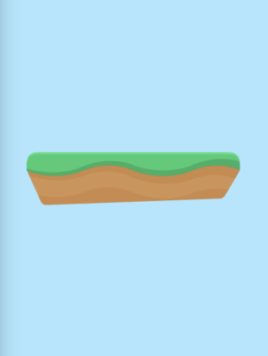

# 介绍

首先，我们感谢你下载了这本书。

我们将用10个章节来引导你以ES6+的Javascript为基础，使用Phaser3来写一个HTML5游戏。

这个游戏的玩法将会设定为类似于涂鸦跳跃(Doodle Jump)的无限跳跃玩法。

具体规则是你的游戏角色需要尽可能地通过从上往下不断出现的平台向上跳跃，而这些平台则会在他们到达屏幕最底部时消失。

当你掉落到屏幕底部时，则会视为死亡。噢，我的老天爷，当然不是在说你，是你的角色。你当然可以不断重新开始游戏。

## 为什么选择Web端而不是Unity？

Phaser3是一款非常不错的游戏框架，初学者不但能够快速入门，也足够让开发者实现能想象到的几乎所有2D游戏。

Web端和ES6+的JavaScript是很理想的开发平台和适合初学者入门的语言。

虽然我也曾想过要不要写一本Unity入门书，但可惜它并不如前者那样。它的客户端像机场一样巨大得让人害怕。你肯定认为这个集成了一大堆东西的开发环境都能用得上，但显然，它不是。

在这本书里，你需要的顶多仅仅是一个代码编辑器(本文使用的是Visual Studio Code)，其他的则是最基础的浏览器(本文推荐Chrome)和网络。

## 为什么选择ES6+？

ES6+的语法结构、代码风格，随着时间推移，也终将成为JavaScript的常规规范。

且它同时也让JavaScript更易于学习，以及少了很多在使用其他开发语言的开发者看来比较奇怪的语法和操作。

ES6+的JavaScript在作者看来，是实实在在拥有自己的价值的语言。

在不久以前，使用ES6+的Javascript的唯一途径是引入一些配置较为复杂的开发工具。这对于初学者或者新建一个相对应语法的项目的开发者来说十分不友好，也因此产生了大量半途而废的初学者。

但请放心，在这本书里并不需要，也没有这些乱七八糟的工具和配置。

## 怎么使用这本入门书？

这本书将会引导你阅读，并手把手地从教你把游戏开始创建直到完成。

因此这本书其实并不容易跳着阅读或者随手查哪些特定内容。

每一个章节的设计，都是紧随于上一个章节的，随着内容的推进，难度也会逐步上升。

这也不是一本教你怎么用ES6+的JavaScript的书。

因此我们希望你在此之前能够拥有JavaScript语言的知识基础，相关基础知识你也可以先去Codecademy、Udemy学习一些简单的课程来进行了解。

除此之外，也请放心，任何有关代码和游戏开发的概念的疑问，我们都会在书中一一解释。

我们的目标是让你在学习时不会感到难受，相反，我们更倾向于让你乐在其中，甚至希望你能在跟随书本进行开发时，加入一些属于你自己的元素或改动。

## 完整的实例代码

你可以在Bunny Jump的Github中获取本书涉及的完整实例代码：

https://github.com/ourcade/infinite-jumper-template-phaser3

注意，这个项目仓库使用了git-lfs，如果你使用git clone命令来拷贝该项目，为保证你能将里面的图片、音频等资源下载下来，请确保你的电脑是否也已经安装了git-lfs。

当然，你也能直接进入该项目的[Releases Section](https://github.com/ourcade/infinite-jumper-template-phaser3/releases)中直接下载包含所有项目内容的zip压缩包：

## 在线学习视频

如果你遇到了阻碍，我们也在Youtube提供了对应[10个章节的视频](https://github.com/ourcade/infinite-jumper-template-phaser3)，你也能在此留言和其他人一起相互讨论。

同时我们也会像你一样尽可能逐章阅读这本书，遇到任何错误或者问题的话也会及时纠正。

你也能在我们的[Youtube频道](http://youtube.com/ourcadehq)或[点击这里](https://www.youtube.com/playlist?list=PLumYWZ2t7CRtojYrBNKu-TSXY5VbTGzIY)找到我们的视频播放列表。

## 更多资源

一旦你能熟练掌握这本书的基础内容，那么你就可以进入到下一步，去试着学习用标准的JavaScript开发工具(如Node.js、NPM等)新建一个项目了。恰巧，我们关于(如何从0开发一个Phaser游戏)[https://www.youtube.com/playlist?list=PLumYWZ2t7CRvdJJ206QarbisxYPAyYwj0]的视频，正是为你的下一步而准备的。

在视频中，我们将会从创建一个空文件夹开始，然后用VS Code、NPM和一些命令行构建Phaser3项目。

随后，我们建议看一看我们的(知识回顾)[https://www.youtube.com/playlist?list=PLumYWZ2t7CRuhzvpSeCvRLUZv2xKgO_wh]，其中包含了更多你能买到的(进阶文章和课程)[https://gum.co/moEDH]。

---

我们有强烈的意愿来更新和完善这本书。如果有什么错误、不清晰的描述，或者其他任何问题，请通过我们的邮箱tommy@ourcade.co或推特(@ourcadehq)[http://twitter.com/ourcadehq]留言告诉我们。

好了，废话不再多说，我们现在就开始开发我们的游戏吧！

---

***Ourcade是一个为开发者和学者们提供的很有意思的能让你发散思维游戏开发者论坛。***

# 好戏开始

我们会让所有前置准备尽可能地简化。

如果你是已经知道要做什么的Web开发者有，那么你肯定知道有很多的工具让事情变得容易和简单。

实际上，所有的工具都很可能反作用于初学者，把原本不复杂的事情变得更加摸不着头脑。

这本书不会使用Node和NPM，当然我们也不会假设你能够熟练使用命令行。

你只需要一个现代化的浏览器(如Google Chrome)，以及一个代码编辑器(如Visual Studio Code，简称VS Code)。

你还没准备好的话就快去下载吧，在本书中就不再提供这些基本工具的下载地址了，相信对你来说这并不困难。

## 创建一个新建文件夹

我们的游戏代码将会放在一个文件夹内，不介意的话我们可以把它命名为"bunny-jump"，并放在你的电脑的任何地方。噢！桌面就不错。

然后我们再在"bunny-jump"文件夹里面创建一个命名为"src"的文件夹。我们所有的JavaScript代码将会放到这来。

现在，我们打开VS Code，打开"bunny-jump"文件夹。

在创建实际的文件之前，我们还要多做一个步骤。

## Development Server

"Development Server"这词语听起来很高大上，实际上只是一个运行在我们电脑中的一个程序。

在这里，我们将依靠它来运行我们的游戏。

我们会简单地在VS Code中使用"Live Server"插件来完成这一步骤。

在VS Code窗口中，我们点击最左侧菜单的图标为四个小方块的按钮，这个就是VS Code的插件商城，在里面你可以输入"Live Server"进行搜索，找到标注作者为"Ritwick Dey"的"Live Server"后点击安装，然后稍等片刻。

安装完成后，你就能在VS Code窗口底部状态栏的右下角看到一个新增的"Go Live"按钮。

当然，你也可以用VS Code的组合快捷键(Shift + Cmd / Ctrl + P)换起命令行窗口，输入"Live Server"查看它的所有Live Server命令行。

在这里，我们只需要使用"Open with Live Server"命令，或点击"Go Live"按钮就能开启一个Development Server了。

## 创建index.html

每个Web应用都需要一个index.html文件，Phaser的游戏项目也不例外。

在VS Code左侧的文件管理菜单中，在你的主目录(bunny-jump内，与src文件夹平级)中单击鼠标右键，选择"New File"心间文件，并命名为"index.html"。

在左侧的文件管理菜单中双击点开index.html文件进行编辑，输入以下代码：

```html
<html>
  <head>
    <title>Bunny Jump!</title>
    <script
      src="//cdn.jsdelivr.net/npm/phaser@3.55.2/dist/phaser.js">
    </script>
  </head>
  <body>
    <script type="module" src="src/main.js"></script>
  </body>
</html>
```

第5行代码正是我们在互联网中引入Phaser3框架的代码。

然后第9行代码则是引入我们即将要创建，包含我们的JavaScript代码的的main.js文件。

我们的游戏代码将在main.js文件中开始写入，这也称为我们游戏的入口文件。

## 创建入口文件

用创建index.html同样的方式，在src文件夹中创建一个新的main.js文件，这里你则需要选中src文件夹，鼠标右键选择"New File"来进行创建文件。

创建完成后，打开我们的main.js文件。

然后我们首先在里面来新增一行简单的代码，实现在浏览器的控制台中输出一行信息吧：

```js
console.log('Hello, World!')
```

## 来Go Live吧！

我们虽然还没有很多内容，但现在已经足以让我们测试一下我们的项目配置是否正常工作了！

***专业提示：提前和频繁地测试，有助于减少后续开发时不必要的烦恼***

再次点击VS Code底部状态栏右下角的"Go Live"按钮，或唤出命令行窗口选择"Open With Live Server"选项，正如同我们在[Development Server](#development-server)小节中说的。

Live Server会为你尽可能打开一个浏览器窗口，并访问一个类似于localhost:5500的地址。

如果它并没有这么做，那么在VS Code底部状态栏的右下角将会弹出一条提示信息告诉你现在运行于什么端口(port)。然后你可以自行打开一个浏览器窗口，并输入"localhost:PORT_NUMBER"，注意此处PORT_NUMBER替换为提示信息提供的端口(port)。

如果你得到的是一个空白的页面，则表示你的development server已经正在运行了，并且浏览器窗口的标签页标题应该就是"Bunny Jump"，或者你在index.html文件中于<title></title>标签之间输入的任意内容。

在空白页面中单击鼠标右键，选择"检查"选项，浏览器将会弹出开发者工具窗口，你应该就能看到"Hello, World!"这条信息出现在控制台了！

## 排除故障

如果你运行时出现了问题，那么请确保你创建的项目目录结构是以下这样的：

```
bunny-jump
  o-- src
    -- main.js
  -- index.html
```

我们也随时欢迎你在我们的推特[@ourcadehq](http://twitter.com/ourcadehq)中留言提问。

## ES6+的JavaScript

在不久以前，你无法在不引入一大堆工具和依赖库的情况下使用ES6+的JavaScript。

初学者往往会局限于学习传统的JavaScript，但现在已经不再是这也的情况了。

ES6+的JavaScript更易于理解，以及入门。它现在已经变得更加适应开发者的编码习惯了。

这也是为什么我们要在此书中使用ES6+的JavaScript的原因。

Phaser已经包含于全局当中，你可以在你的代码里直接使用window.Phaser，这确实很方便，但这并不推荐在ES6+的JavaScript中使用。

而且这也无法让VS Code提供智能的代码自动补全功能，那这花里胡哨的操作又能帮得上我们什么忙呢？

我们需要做两件事，来让我们的Phaser3合理地运行在ES6+的JavaScript代码中，并且同时使用上VS Code的IntelliSense特性。

## 模块化的使用

模块化是另一个不错的功能，你可以粗略地将它们理解为JavaScript文件。

我们可以用模块化的文件引入很多包，用以下这种句式：

```js
import { banana } from './fruits.js'
```

上面这句代码是用于从一个称为fruits.js的模块中导入一个banana。

fruits.js文件的代码可以看成是以下这样：

```js
const banana = {
  color: 'yellow',
  ripe: true
}

export {
  banana
}
```

在这里我们可以看到我们用export关键字导出了banana，这也就是为什么我们能够在前一个例子中导入它的原因。

我们想要在Phaser上做同样的事情，但我们没有任何一个文件导出Phaser？记住我们是有通过<script>标签中加载线上发行版的Phaser的。

发行版唯一的意义仅仅是使Phaser源代码经过一连串的工具，将它变为体积更小的单个包，以至于它能够兼容最新和较早版本的浏览器。

所以我们要怎么解决这个问题呢？游戏开发和普遍的软件工程其实一般都是关于解决问题的学术。

第一步，在src文件夹中创建一个lib文件夹，然后在lib文件夹中创建一个文件并命名为"phaser.js"。

phaser.js中则能够非常简单地导出window.Phaser。

```js
export default window.Phaser
```

接着我们就能在main.js文件中导入Phaser了。我们把下面的代码替换进main.js中：

```js
import Phaser from './lib/phaser.js'

console.log(Phaser)
```

保存我们的文件，Live Server应该就会侦测到你的改动，并且自动重新加载。如果没有重新加载，那么你就必须停止并重新运行Live Server了，或者你也可以尝试多刷新几次浏览器的页面试试看。

不出意外，这时候你应该能够看到一个对象被输出到浏览器的控制台了。你可以点一下它，它就会展示属于Phaser的一系列的属性，然后你就可以观察一下这里面的内容了。

请确保在你的import语句中包含了.js拓展名，否则你将可能会得到一个关于MIME类型的错误提示。

## VS Code的IntelliSense

在开始写我们的游戏的代码之前，我们还要做多一件事。

Visual Studio Code是一个绝赞的代码编辑器，它拥有成千上万的专业用户，用来开发我们每天都在使用的各种Apps。

最重要的是！它完全免费！

VS Code中有一个非常有用的功能，就是代码自动补全功能(IntelliSense)。

为了让这个功能也能够支持到像Phaser这样的第三方库，我们需要在这些库的类型定义上进行一些操作。

Phaser包含了一个官方的类型定义文件，你能够在它[官方的Github仓库](https://github.com/photonstorm/phaser/tree/master/types)中的types文件夹中找到它。

***如果这个链接打不开，你可以尝试直接访问[Github.com](https://github.com)，然后搜索"photonstorm/phaser"***

点击phaser.d.ts，然后点击Github的下载按钮来下载该文件，或者你也可以点击"View Raw"按钮，然后复制粘贴里面的内容到一个新建文件里面，并命名为"phaser.d.ts"。

在src文件夹内新建一个文件夹并命名为"types"，然后把phaser.d.ts文件放进去。

下一步，在项目的主目录下(即与index.html同层级)，新建一个文件并命名为"jsconfig.json"，然后插入以下的内容：

```json
{
  "complierOptions": {
    "module": "es6",
    "target": "es6"
  }
}
```

这个文件是用来配置JavaScript在VS Code中的处理方式的。

到目前为止，我们的项目目录结构看起来应该是这样的：

```
bunny-jump
  o-- src
    o-- types
      -- phaser.d.ts
    -- main.js
  -- index.html
  -- jsconfig.json
```

回到main.js文件中，输入"Phaser."，你应该就能看到一个行内的菜单，里面包含了属于Phaser的不同属性，比如"AUTO"。

如果你遇到解决不了的问题，可以在我们的推特(@ourcadehq)[http://twitter.com/ourcadehq]留言，你可以附上你在VS Code的截图，又或者是一个包含你遇到的问题的短视频。

## 准备好了吗，头号玩家？

你的项目现在已经配置完毕，可以正式准备起飞啦！

在下一章节中，你将会开始创建一个类似于涂鸦跳跃(Doodle Jump)的简易的无限跳跃游戏。

让我们马上开始吧！

# 配置游戏

在我们的Bunny Jump游戏中，我们需要用到包含了一部分素材的[Jumper Pack assets from Kenney](https://kenney.nl/assets/jumper-pack)素材包。以下是这个素材包的预览图：


你可以免费下载和使用这个素材包，Kenny有一大堆开放的美术资源库来帮助你制作原型。

你可以访问[http://kenney.nl](http://kenney.nl)，然后点击左侧导航栏中的"Assets"，并搜索"Jumper Pack"来下载并解压资源包。

这本书仅仅会使用很小一部分的资源来构建一个基础版本的无限跳跃游戏。

当然了，你也能用其他的资源来额外添加一些更有趣的功能和玩法！

以下这是我们即将用上的5个资源。

```
Jumper Pack
  o-- PNG
    o-- Background
      -- bg_layer_1.png
    o-- Environment
      -- ground_grass.png
    o-- Items
      -- carrot.png
    o-- Player
      -- bunny1_stand.png
      -- bunny1_jump.png
```

复制这5个图片到你的项目主文件夹的assets文件夹中，assets文件夹未创建则自行创建即可，但注意assets文件夹所处的位置应该是和src文件夹处于同一个层级，即项目的主目录中。

## 创建一个Phaser游戏

接下来，我们将会在我们的main.js文件里创建一个Phaser.Game实例对象。

创建Phaser.Game对象，我们需要传入一组配置对象，用于定义如游戏界面的宽高等信息。

[点击这里](https://newdocs.phaser.io/docs/3.55.2/Phaser.Types.Core.GameConfig)你还能看到更多关于它的其他配置项，而它们中大部分都会有默认值。

请在我们的main.js文件，将以下代码放在导入Phaser的代码后面：

```js
export default new Phaser.Game({
  type: Phaser.AUTO,
  width: 480,
  height: 640
})
```

你可以看到，我们在这段代码里定义了我们的游戏窗口尺寸为480x640；而类型(type)属性则设置为了Phaser.AUTO，意思是Phaser将会以Canvas和WebGL的形式运行于我们的设备和浏览器中。

好！那么，接下来的下一小节我们将会创建一个场景(Scene)。

## 创建一个场景(Scene)

"场景(Scene)"的作用是将游戏对象和逻辑组合关联在一起。

它是一个在你实际用到它之前不太好理解的概念。

比如，我们将要创建一个包含了关于我们的游戏核心玩法——无限跳跃机制的所有逻辑的场景。

再然后，我们还会再创建一个包含与Game Over相关的逻辑和对象的场景(Scene)。

场景(Scene)为我们提供了一个将游戏中不同的组成部分分别逻辑化的方式。

为了更好地创建场景(Scene)，我们需要在src文件夹中创建一个新的文件夹并命名为scenes，方便我们区分和存放场景的代码文件。然后我们在scenes文件夹里再新建一个名为Game.js的文件。

我们的游戏场景将会是一个继承于Phaser.Scene的类(class)。

### 打断一下，我们先来了解一下类(Class)

类(Class)是一个面向对象编程的概念，用以封装或概括通用的数据和逻辑，并且你能够用来依靠它来创建一个实例对象。

想象一下，你有一个兔子(Rabbit)类，其中包含了一项能量(energy)数据。用这个类，我们可以创建两个实例对象，分别为能量为100(energy=100)的年轻兔子，和能量为50(energy=50)的老兔子。

毫无疑问，两只兔子虽然都拥有一样的组成一样的构造——除了他们的状态。

好了，概念应该了解得差不多了，我们来实践一下，加深一下我们对类(Class)的理解吧！

回到我们的游戏场景，我们需要在Game.js文件里写入以下代码：

```js
import Phaser from '../lib/phaser.js'

export default class Game extends Phaser.Scene {
  constructor() {
    super('game')
  }
  preload() {}
  create() {}
}
```

每一个场景，我们都要定义一个唯一关键字(Key)，我们在上述代码的第3行，构造器函数(constructor)内调用了supuer('game')来定义。

preload()和create()函数则是Phaser中会在合适的时机执行的钩子函数。

preload()函数一般用于在场景生效前加载我们通用的图片、音频等资源。

create()函数将会在我们所有资源加载完毕后调用，在create()函数中，我们已经能够使用所有已经加载完毕的资源了。不过，如果你非要试着在这里使用一个未曾加载的资源，那么你将会得到一条报错信息。

## 启动游戏场景

我们已经定义了一个基础的游戏场景类，但实际上Phaser根本一无所知！

因此我们必须要在main.js中将刚才我们的场景导入，并且配置到我们的Phaser.Game里面去，像这样：

```js
import Phaser from './lib/phaser.js'
import Game from './scenes/Game.js'

export default new Phaser.Game({
  type: Phaser.AUTO,
  width: 480,
  height: 640,
  scene: Game
})
```

我们新创建的游戏场景在以上代码的第2行引入，并且在第8行代码中告诉Phaser应该运行于这一个场景当中。

保存我们的更改，但我们会在浏览器页面里发现依然是黑色一片，看不到任何可见的变化。

但是，我们保证，它会在下一小节让他发生变化的！

## 预加载背景

我们目前已经有一个名为bg_layer1.png的图片文件在我们的assets文件夹中。

让我们在preload()函数中加载它，并在create()函数中使用它吧！

```js
preload() {
  this.load.image('background', 'assets/bg_layer_1.png')
}
```

记住我们这里使用的关键字是**this**，它指向的是这个类的实例，而不是类本身。在这个例子里面确切地说，this是指向现在的Game场景实例。

继承自Phaser.scene，场景实例中会包含了一个称为load的属性对象，[点击这里](https://newdocs.phaser.io/docs/3.55.2/Phaser.Scene)可以访问文档查阅详情。

除此之外，由于Game类继承自Phaser.Scene，因此它同时也会其他拥有所有Phaser.Scene的函数和属性。这在面向对象编程中称为"继承"。

load属性实际上也是Phaser.Loader.LoaderPlugin类的实例，它包含了包括图片、音频、精灵图等资源的加载逻辑。

使用VS Code IntelliSense能够在你输入"this.load."时快速检索有关于load对象的所有函数和属性。

在上面的示例中，我们先简单地引入了一张图片资源，并为它定义了一个唯一关键字(key)——"background"，以及指定了图片文件的相对路径。

这里定义的唯一关键字将会在后面创建由Phaser渲染图片或精灵资源等时用到。

## 创建背景

随着图片文件bg_layer1.png的导入，我们现在可以在create()函数里把它加入到我们的游戏场景中了：

```js
create() {
  this.add.image(240, 320, 'background')
}
```

你可以看到，这行代码除了传入的参数以外，和我们在preload()函数时引入图片资源的样子十分相似，只是取而代之的是this.add，而非this.load。

以及，我们添加的是内容是一张图片，对应的我们调用的则是"image"函数，前面两个数值参数分别是x坐标和y坐标，最后面的参数则是我们在preload()函数中为bg_layer1.png定义的唯一关键字(key)。

保存我们的更改，在浏览器页面重新加载后，你应该就能看到一张蓝色背景出现在了画面上了。

既然游戏场景配置好了，接下来我们就给游戏加点游戏的逻辑吧~

# 生成平台

一个无限跳跃游戏的目标就是尽可能地在平台上弹跳并保持在空中。

那么我们就来加一些平台吧！

首先，我们必须在preload()函数中预加载平台的图片资源，就像你在上一个章节中所做的那样：

```js
preload() {
  this.load.image('background', 'assets/bg_layer_1.png')

  // 加载平台图片资源
  this.load.image('platform', 'assets/ground_grass.png')
}
```

这行代码你应该已经比较熟悉了，this.load.image()的第一个参数是图片资源的唯一关键字(key)，第二个参数则是来自开发服务(对应本项目中的Live Server)的对应图片资源的文件相对路径。

这个路径实际上并不是本地文件的路径。

你可以试试这个操作，当你的开发服务正在运行时，在浏览器里访问localhost:5500/assets/ground_grass.png。

Live Server插件能够让你项目所有的文件夹作为一个整体服务。

回到正题，在平台的图片资源加载完毕后，我们就能够在create()函数里创建平台了：

```js
create() {
  this.add.image(240, 320, 'background')

  // 添加一个平台到画面的中间
  this.add.image(240, 320, 'platform')
}
```

保存你的代码后，你的游戏大概会长这样：



这里有两个问题，第一，平台太大了！其次，它仅仅是一张图片，并不具备任何物理特性！

我们先来解决第一个问题，按照这样对图片进行缩放：

```js
this.add.image(240, 320, 'platform')
  .setScale(0.5)
```

平台缩小了一半，看起来好多了！接下来是物理特性！

## 加入Arcade物理引擎

Phaser的物理引擎拥有很多种配置项，我们将会使用Arcade物理引擎，以至于不让事情变得很复杂。

我们首先要做的第一件事是，在导出游戏对象的配置项里启用Arcade物理引擎。

来像这样更新下我们的main.js的代码：

```js
export default new Phaser.Game({
  type: Phaser.AUTO,
  width: 480,
  height: 640,
  scene: Game,
  physics: {
    default: 'arcade',
    arcade: {
      gravity: {
        y: 200
      },
      debug: true
    }
  }
})
```

注意我们在这里添加了physics属性。此外要提的是我们在这里将debug置为true，以至于我们能够直观地观察碰撞盒子。

## 添加一个拥有物理特性的平台

现在我们的Arcade物理引擎已经启用了，那接下来我们就开始创建一个拥有物理特性的平台吧。把刚才的平台创建代码替换为：

```js
// 把这个代码替换掉
// this.add.image(240, 320, 'platform')
//   .setScale(0.5)

// 换成这个
this.physics.add.image(240, 320, 'platform')
  .setScale(0.5)
```

随着这个在游戏场景中的改动，你应该能看到这个平台从屏幕上坠落了。

实际上，我们想要的效果是这个平台停留在它们一开始的位置，能达到这个效果的，就是静态物体(static physics body)。

使用**this.physics.add.staticImage()**是一个方式，但我们实际的需求不仅仅是单个平台，而是一系列的平台。

所以我们还可以用**this.physics.add.staticGroup**一次性地解决以上两个问题。

## 添加多个平台

以下就是使用StaticGroup来创建拥有物理特性的平台的代码：

```js
create() {
  // 提出这个代码
  this.physics.add.image(240, 320, 'platform')
    .setScale(0.5)
  
  // 创建一个组对象
  const platforms = this.physics.add.staticGroup()

  // 然后在组对象内创建五个平台
  for(let i = 0; i < 5; i++) {
    const x = Phaser.Math.Between(80, 400)
    const y = 150 * i

    /** @type {Phaser.Physics.Arcade.Sprite} */
    const platform = platform.create(x, y, 'platform')
    platform.scale = 0.5

    /** @type {Phaser.Physics.Arcade.StaticBody} */
    const body = platform.body
    body.updateFromGameObject()
  }
}
```

这段代码里，我们首先是创建了一个StaticGroup对象，并命名为platforms。

然后我们使用了一个for循环来创建了5个平台，并使它们各自的x坐标在80-400的范围内随机，y轴则逐个递增150像素。

注意，我们依然需要像刚才那样将每个平台缩小为原来的0.5倍。

关于"/** */"之间的内容，它被称为JSDoc注释，我们目前还不必在意它。只需要知道它能够帮助VS Code给到我们正确的代码自动补全就行了。

而最后我们还需要调用updateFromGameObject()函数，这会基于我们在GameObject中所作的任何更改(如位置、缩放等)来刷新我们的物体。

现在，我们的游戏界面看起来应该是这样的了：

!(当前效果图)[./static/book_game2.png]

每个平台的实际位置都是不同的，因为我们为它们的x轴使用了随机值，你可以刷新你的浏览器页面，你会发现它们每一次刷新位置都会发生变化。

---

我们在游戏里已经有了合适尺寸的平台。

我们还需要一个能够有什么东西或者谁来跳在这些平台之上。

# 创建我们的主角

