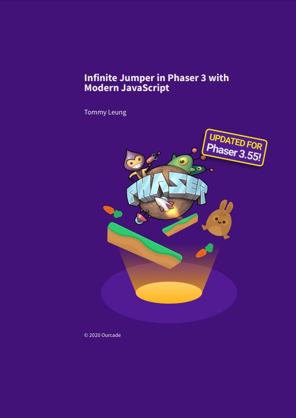
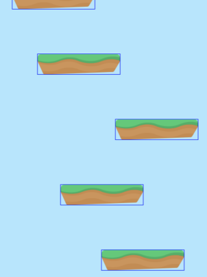
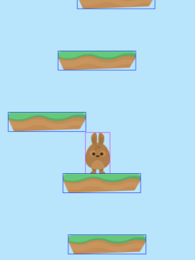
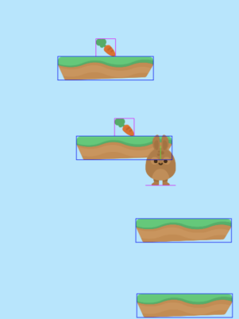
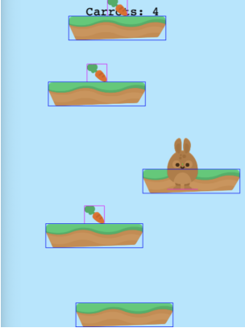
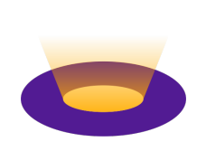
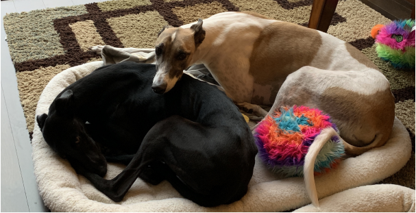

# 封面



# 目录

[TOC]


# 译者的话

这本书是我入门Phaser，也是我个人尝试翻译的第一本书，本人英文比较蹩脚，结合Google翻译和ChatGPT能达到这个成果，就我个人而言已经十分满足了，各位看官千万别嫌弃，毕竟无论学习还是翻译，千里之行始于足下，迈出第一步至关重要。

## 敬作者(for the Author)

感谢您免费提供的pdf电子书，让我受益良多，作为第一本入门的书，您写的内容通俗易懂，也让我完成了我人生中真正意义上完整的游戏作品。虽然最终的作品并不是满分作品，但这也将是我未来开发更多游戏的基石。

请放心，我翻译此文的目的纯粹是为了学习和参透您书本中的全部内容，主要原因是我在寻找Phaser相关教程内容时，发现中文相关的参考内容实在太少，才突发奇想想要为自己翻译您这本珍贵的入门教学书，以便于后续能够随时更加方便地回顾书本中的知识。

再次感谢您，敬爱的作者。

Thank you very much for providing the PDF e-book for free. I learned a lot from it, and as the first introductory book on game development, your content was easy to understand and helped me complete my first meaningful game project. Although the final product was not perfect, this will be the cornerstone for me to develop more games in the future.

Please rest assured that the purpose of my translating this article is purely for learning and understanding all the contents in your book. The main reason is that I found there are very few Chinese resources related to Phaser tutorials, which inspired me to translate your precious introductory book so that I can review the knowledge conveniently in the future.

Once again, thank you, dear author.

---

如有侵权，请马上发送邮件或发送私信，本人将第一时间响应并对文章做出处理！感谢您的支持！

If there is any infringement, please send an email or private message immediately.

I will respond promptly and take necessary actions to handle the article.

Thank you for your support!

## 温馨提示(Reminder)

本文非官方译文或精翻版本，未经任何校对，仅用于对原文的辅助参考理解和阅读，如有任何翻译错漏或版本差异，请自行查鉴！

This article is an unofficial translation or paraphrasing, and has not been proofread.

It is only intended as an aid for understanding and reading the original text.

If there are any errors or differences in translation, please verify them yourself.

## 警告(Warning)

本译文仅供个人学习参考用途，请勿私自传播或进行商业用途，否则请自行承担相应的法律责任，本人概不承担任何法律责任！

如有需要，敬请支持并购买正版书籍。

This translation is for personal study and reference only. Please do not distribute or use it for commercial purposes without permission, otherwise you will bear the corresponding legal responsibility, and I do not assume any legal liability.

If necessary, please support and purchase the original books.

## 附录

正版获取：[https://blog.ourcade.co](https://blog.ourcade.co/)

# 介绍

首先，我们感谢你下载了这本书。

我们将用10个章节来引导你以ES6+的Javascript为基础，使用Phaser3来写一个HTML5游戏。

这个游戏的玩法将会设定为类似于涂鸦跳跃(Doodle Jump)的无限跳跃玩法。

具体规则是你的游戏角色需要尽可能地通过从上往下不断出现的平台向上跳跃，而这些平台则会在他们到界面最底部时消失。

当你掉落到界面底部时，则会视为死亡。噢，我的老天爷，当然不是在说你，是你的角色。你当然可以不断重新开始游戏。

## 为什么选择Web端而不是Unity？

Phaser3是一款非常不错的游戏框架，初学者不但能够快速入门，也足够让开发者实现能想象到的几乎所有2D游戏。

Web端和ES6+的JavaScript是很理想的开发平台和适合初学者入门的语言。

虽然我也曾想过要不要写一本Unity入门书，但可惜它并不如前者那样。它的客户端像机场一样巨大得让人害怕。你肯定认为这个集成了一大堆东西的开发环境都能用得上，但显然，它不是。

在这本书里，你需要的顶多仅仅是一个代码编辑器(本文使用的是Visual Studio Code)，其他的则是最基础的浏览器(本文推荐Chrome)和网络。

## 为什么选择ES6+？

ES6+的语法结构、代码风格，随着时间推移，也终将成为JavaScript的常规规范。

且它同时也让JavaScript更易于学习，以及少了很多在使用其他开发语言的开发者看来比较奇怪的语法和操作。

ES6+的JavaScript在作者看来，是实实在在拥有自己的价值的语言。

在不久以前，使用ES6+的Javascript的唯一途径是引入一些配置较为复杂的开发工具。这对于初学者或者新建一个相对应语法的项目的开发者来说十分不友好，也因此产生了大量半途而废的初学者。

但请放心，在这本书里并不需要，也没有这些乱七八糟的工具和配置。

## 怎么使用这本入门书？

这本书将会引导你阅读，并手把手地从教你把游戏开始创建直到完成。

因此这本书其实并不容易跳着阅读或者随手查哪些特定内容。

每一个章节的设计，都是紧随于上一个章节的，随着内容的推进，难度也会逐步上升。

这也不是一本教你怎么用ES6+的JavaScript的书。

因此我们希望你在此之前能够拥有JavaScript语言的知识基础，相关基础知识你也可以先去Codecademy、Udemy学习一些简单的课程来进行了解。

除此之外，也请放心，任何有关代码和游戏开发的概念的疑问，我们都会在书中一一解释。

我们的目标是让你在学习时不会感到难受，相反，我们更倾向于让你乐在其中，甚至希望你能在跟随书本进行开发时，加入一些属于你自己的元素或改动。

## 完整的实例代码

你可以在Bunny Jump的Github中获取本书涉及的完整实例代码：

https://github.com/ourcade/infinite-jumper-template-phaser3

注意，这个项目仓库使用了git-lfs，如果你使用git clone命令来拷贝该项目，为保证你能将里面的图片、音频等资源下载下来，请确保你的电脑是否也已经安装了git-lfs。

当然，你也能直接进入该项目的[Releases Section](https://github.com/ourcade/infinite-jumper-template-phaser3/releases)中直接下载包含所有项目内容的zip压缩包：

## 在线学习视频

如果你遇到了阻碍，我们也在YouTube提供了对应[10个章节的视频](https://github.com/ourcade/infinite-jumper-template-phaser3)，你也能在此留言和其他人一起相互讨论。

同时我们也会像你一样尽可能逐章阅读这本书，遇到任何错误或者问题的话也会及时纠正。

你也能在我们的[YouTube频道](http://youtube.com/ourcadehq)或[点击这里](https://www.youtube.com/playlist?list=PLumYWZ2t7CRtojYrBNKu-TSXY5VbTGzIY)找到我们的视频播放列表。

## 更多资源

一旦你能熟练掌握这本书的基础内容，那么你就可以进入到下一步，去试着学习用标准的JavaScript开发工具(如Node.js、NPM等)新建一个项目了。恰巧，我们关于[如何从0开发一个Phaser游戏](https://www.youtube.com/playlist?list=PLumYWZ2t7CRvdJJ206QarbisxYPAyYwj0)的视频，正是为你的下一步而准备的。

在视频中，我们将会从创建一个空文件夹开始，然后用VS Code、NPM和一些命令行构建Phaser3项目。

随后，我们建议看一看我们的 [知识回顾](https://www.youtube.com/playlist?list=PLumYWZ2t7CRuhzvpSeCvRLUZv2xKgO_wh) ，其中包含了更多你能买到的[进阶文章和课程](https://gum.co/moEDH)。

---

我们有强烈的意愿来更新和完善这本书。如果有什么错误、不清晰的描述，或者其他任何问题，请通过我们的邮箱tommy@ourcade.co或推特[@ourcadehq](http://twitter.com/ourcadehq)留言告诉我们。

好了，废话不再多说，我们现在就开始开发我们的游戏吧！

---

***Ourcade是一个为开发者和学者们提供的很有意思的能让你发散思维游戏开发者论坛。***

# 好戏开始

我们会让所有前置准备尽可能地简化。

如果你是已经知道要做什么的Web开发者有，那么你肯定知道有很多的工具让事情变得容易和简单。

实际上，所有的工具都很可能反作用于初学者，把原本不复杂的事情变得更加摸不着头脑。

这本书不会使用Node和NPM，当然我们也不会假设你能够熟练使用命令行。

你只需要一个现代化的浏览器(如Google Chrome)，以及一个代码编辑器(如Visual Studio Code，简称VS Code)。

你还没准备好的话就快去下载吧，在本书中就不再提供这些基本工具的下载地址了，相信对你来说这并不困难。

## 创建一个新建文件夹

我们的游戏代码将会放在一个文件夹内，不介意的话我们可以把它命名为"bunny-jump"，并放在你的电脑的任何地方。噢！桌面就不错。

然后我们再在"bunny-jump"文件夹里面创建一个命名为"src"的文件夹。我们所有的JavaScript代码将会放到这来。

现在，我们打开VS Code，打开"bunny-jump"文件夹。

在创建实际的文件之前，我们还要多做一个步骤。

## Development Server

"Development Server"这词语听起来很高大上，实际上只是一个运行在我们电脑中的一个程序。

在这里，我们将依靠它来运行我们的游戏。

我们会简单地在VS Code中使用"Live Server"插件来完成这一步骤。

在VS Code窗口中，我们点击最左侧菜单的图标为四个小方块的按钮，这个就是VS Code的插件商城，在里面你可以输入"Live Server"进行搜索，找到标注作者为"Ritwick Dey"的"Live Server"后点击安装，然后稍等片刻。

安装完成后，你就能在VS Code窗口底部状态栏的右下角看到一个新增的"Go Live"按钮。

当然，你也可以用VS Code的组合快捷键(Shift + Cmd / Ctrl + P)换起命令行窗口，输入"Live Server"查看它的所有Live Server命令行。

在这里，我们只需要使用"Open with Live Server"命令，或点击"Go Live"按钮就能开启一个Development Server了。

## 创建index.html

每个Web应用都需要一个index.html文件，Phaser的游戏项目也不例外。

在VS Code左侧的文件管理菜单中，在你的主目录(bunny-jump内，与src文件夹平级)中单击鼠标右键，选择"New File"心间文件，并命名为"index.html"。

在左侧的文件管理菜单中双击点开index.html文件进行编辑，输入以下代码：

```html
<html>
  <head>
    <title>Bunny Jump!</title>
    <script
      src="//cdn.jsdelivr.net/npm/phaser@3.55.2/dist/phaser.js">
    </script>
  </head>
  <body>
    <script type="module" src="src/main.js"></script>
  </body>
</html>
```

第5行代码正是我们在互联网中引入Phaser3框架的代码。

然后第9行代码则是引入我们即将要创建，包含我们的JavaScript代码的的main.js文件。

我们的游戏代码将在main.js文件中开始写入，这也称为我们游戏的入口文件。

## 创建入口文件

用创建index.html同样的方式，在src文件夹中创建一个新的main.js文件，这里你则需要选中src文件夹，鼠标右键选择"New File"来进行创建文件。

创建完成后，打开我们的main.js文件。

然后我们首先在里面来新增一行简单的代码，实现在浏览器的控制台中输出一行信息吧：

```js
console.log('Hello, World!')
```

## 来Go Live吧！

我们虽然还没有很多内容，但现在已经足以让我们测试一下我们的项目配置是否正常工作了！

***专业提示：提前和频繁地测试，有助于减少后续开发时不必要的烦恼***

再次点击VS Code底部状态栏右下角的"Go Live"按钮，或唤出命令行窗口选择"Open With Live Server"选项，正如同我们在[Development Server](#development-server)小节中说的。

Live Server会为你尽可能打开一个浏览器窗口，并访问一个类似于localhost:5500的地址。

如果它并没有这么做，那么在VS Code底部状态栏的右下角将会弹出一条提示信息告诉你现在运行于什么端口(port)。然后你可以自行打开一个浏览器窗口，并输入"localhost:PORT_NUMBER"，注意此处PORT_NUMBER替换为提示信息提供的端口(port)。

如果你得到的是一个空白的页面，则表示你的development server已经正在运行了，并且浏览器窗口的标签页标题应该就是"Bunny Jump"，或者你在index.html文件中于<title></title>标签之间输入的任意内容。

在空白页面中单击鼠标右键，选择"检查"选项，浏览器将会弹出开发者工具窗口，你应该就能看到"Hello, World!"这条信息出现在控制台了！

## 排除故障

如果你运行时出现了问题，那么请确保你创建的项目目录结构是以下这样的：

```
bunny-jump
  o-- src
    -- main.js
  -- index.html
```

我们也随时欢迎你在我们的推特[@ourcadehq](http://twitter.com/ourcadehq)中留言提问。

## ES6+的JavaScript

在不久以前，你无法在不引入一大堆工具和依赖库的情况下使用ES6+的JavaScript。

初学者往往会局限于学习传统的JavaScript，但现在已经不再是这也的情况了。

ES6+的JavaScript更易于理解，以及入门。它现在已经变得更加适应开发者的编码习惯了。

这也是为什么我们要在此书中使用ES6+的JavaScript的原因。

Phaser已经包含于全局当中，你可以在你的代码里直接使用window.Phaser，这确实很方便，但这并不推荐在ES6+的JavaScript中使用。

而且这也无法让VS Code提供智能的代码自动补全功能，那这花里胡哨的操作又能帮得上我们什么忙呢？

我们需要做两件事，来让我们的Phaser3合理地运行在ES6+的JavaScript代码中，并且同时使用上VS Code的IntelliSense特性。

## 模块化的使用

模块化是另一个不错的功能，你可以粗略地将它们理解为JavaScript文件。

我们可以用模块化的文件引入很多包，用以下这种句式：

```js
import { banana } from './fruits.js'
```

上面这句代码是用于从一个称为fruits.js的模块中导入一个banana。

fruits.js文件的代码可以看成是以下这样：

```js
const banana = {
  color: 'yellow',
  ripe: true
}

export {
  banana
}
```

在这里我们可以看到我们用export关键字导出了banana，这也就是为什么我们能够在前一个例子中导入它的原因。

我们想要在Phaser上做同样的事情，但我们没有任何一个文件导出Phaser？记住我们是有通过<script>标签中加载线上发行版的Phaser的。

发行版唯一的意义仅仅是使Phaser源代码经过一连串的工具，将它变为体积更小的单个包，以至于它能够兼容最新和较早版本的浏览器。

所以我们要怎么解决这个问题呢？游戏开发和普遍的软件工程其实一般都是关于解决问题的学术。

第一步，在src文件夹中创建一个lib文件夹，然后在lib文件夹中创建一个文件并命名为"phaser.js"。

phaser.js中则能够非常简单地导出window.Phaser。

```js
export default window.Phaser
```

接着我们就能在main.js文件中导入Phaser了。我们把下面的代码替换进main.js中：

```js
import Phaser from './lib/phaser.js'

console.log(Phaser)
```

保存我们的更改，Live Server应该就会侦测到你的改动，并且自动重新加载。如果没有重新加载，那么你就必须停止并重新运行Live Server了，或者你也可以尝试多刷新几次浏览器的页面试试看。

不出意外，这时候你应该能够看到一个对象被输出到浏览器的控制台了。你可以点一下它，它就会展示属于Phaser的一系列的属性，然后你就可以观察一下这里面的内容了。

请确保在你的import语句中包含了.js拓展名，否则你将可能会得到一个关于MIME类型的错误提示。

## VS Code的IntelliSense

在开始写我们的游戏的代码之前，我们还要做多一件事。

Visual Studio Code是一个绝赞的代码编辑器，它拥有成千上万的专业用户，用来开发我们每天都在使用的各种Apps。

最重要的是！它完全免费！

VS Code中有一个非常有用的功能，就是代码自动补全功能(IntelliSense)。

为了让这个功能也能够支持到像Phaser这样的第三方库，我们需要在这些库的类型定义上进行一些操作。

Phaser包含了一个官方的类型定义文件，你能够在它[官方的Github仓库](https://github.com/photonstorm/phaser/tree/master/types)中的types文件夹中找到它。

***如果这个链接打不开，你可以尝试直接访问[Github.com](https://github.com)，然后搜索"photonstorm/phaser"***

点击phaser.d.ts，然后点击Github的下载按钮来下载该文件，或者你也可以点击"View Raw"按钮，然后复制粘贴里面的内容到一个新建文件里面，并命名为"phaser.d.ts"。

在src文件夹内新建一个文件夹并命名为"types"，然后把phaser.d.ts文件放进去。

下一步，在项目的主目录下(即与index.html同层级)，新建一个文件并命名为"jsconfig.json"，然后插入以下的内容：

```json
{
  "complierOptions": {
    "module": "es6",
    "target": "es6"
  }
}
```

这个文件是用来配置JavaScript在VS Code中的处理方式的。

到目前为止，我们的项目目录结构看起来应该是这样的：

```
bunny-jump
  o-- src
    o-- types
      -- phaser.d.ts
    -- main.js
  -- index.html
  -- jsconfig.json
```

回到main.js文件中，输入"Phaser."，你应该就能看到一个行内的菜单，里面包含了属于Phaser的不同属性，比如"AUTO"。

如果你遇到解决不了的问题，可以在我们的推特[@ourcadehq](http://twitter.com/ourcadehq)留言，你可以附上你在VS Code的截图，又或者是一个包含你遇到的问题的短视频。

## 准备好了吗，头号玩家？

你的项目现在已经配置完毕，可以正式准备起飞啦！

在下一章节中，你将会开始创建一个类似于涂鸦跳跃(Doodle Jump)的简易的无限跳跃游戏。

让我们马上开始吧！

# 配置游戏

在我们的Bunny Jump游戏中，我们需要用到包含了一部分素材的[Jumper Pack assets from Kenney](https://kenney.nl/assets/jumper-pack)素材包。以下是这个素材包的预览图：


你可以免费下载和使用这个素材包，Kenny有一大堆开放的美术资源库来帮助你制作原型。

你可以访问[http://kenney.nl](http://kenney.nl)，然后点击左侧导航栏中的"Assets"，并搜索"Jumper Pack"来下载并解压资源包。

这本书仅仅会使用很小一部分的资源来构建一个基础版本的无限跳跃游戏。

当然了，你也能用其他的资源来额外添加一些更有趣的功能和玩法！

以下这是我们即将用上的5个资源。

```
Jumper Pack
  o-- PNG
    o-- Background
      -- bg_layer_1.png
    o-- Environment
      -- ground_grass.png
    o-- Items
      -- carrot.png
    o-- Player
      -- bunny1_stand.png
      -- bunny1_jump.png
```

复制这5个图片到你的项目主文件夹的assets文件夹中，assets文件夹未创建则自行创建即可，但注意assets文件夹所处的位置应该是和src文件夹处于同一个层级，即项目的主目录中。

## 创建一个Phaser游戏

接下来，我们将会在我们的main.js文件里创建一个Phaser.Game实例对象。

创建Phaser.Game对象，我们需要传入一组配置对象，用于定义如游戏界面的宽高等信息。

[点击这里](https://newdocs.phaser.io/docs/3.55.2/Phaser.Types.Core.GameConfig)你还能看到更多关于它的其他配置项，而它们中大部分都会有默认值。

请在我们的main.js文件，将以下代码放在导入Phaser的代码后面：

```js
export default new Phaser.Game({
  type: Phaser.AUTO,
  width: 480,
  height: 640
})
```

你可以看到，我们在这段代码里定义了我们的游戏窗口尺寸为480x640；而类型(type)属性则设置为了Phaser.AUTO，意思是Phaser将会以Canvas和WebGL的形式运行于我们的设备和浏览器中。

好！那么，接下来的下一小节我们将会创建一个场景(Scene)。

## 创建一个场景(Scene)

"场景(Scene)"的作用是将游戏对象和逻辑组合关联在一起。

它是一个在你实际用到它之前不太好理解的概念。

比如，我们将要创建一个包含了关于我们的游戏核心玩法——无限跳跃机制的所有逻辑的场景。

再然后，我们还会再创建一个包含与Game Over相关的逻辑和对象的场景(Scene)。

场景(Scene)为我们提供了一个将游戏中不同的组成部分分别逻辑化的方式。

为了更好地创建场景(Scene)，我们需要在src文件夹中创建一个新的文件夹并命名为scenes，方便我们区分和存放场景的代码文件。然后我们在scenes文件夹里再新建一个名为Game.js的文件。

我们的游戏场景将会是一个继承于Phaser.Scene的类(class)。

### 打断一下，我们先来了解一下类(Class)

类(Class)是一个面向对象编程的概念，用以封装或概括通用的数据和逻辑，并且你能够用来依靠它来创建一个实例对象。

想象一下，你有一个兔子(Rabbit)类，其中包含了一项能量(energy)数据。用这个类，我们可以创建两个实例对象，分别为能量为100(energy=100)的年轻兔子，和能量为50(energy=50)的老兔子。

毫无疑问，两只兔子虽然都拥有一样的组成一样的构造——除了他们的状态。

好了，概念应该了解得差不多了，我们来实践一下，加深一下我们对类(Class)的理解吧！

回到我们的游戏场景，我们需要在Game.js文件里写入以下代码：

```js
import Phaser from '../lib/phaser.js'

export default class Game extends Phaser.Scene {
  constructor() {
    super('game')
  }
  preload() {}
  create() {}
}
```

每一个场景，我们都要定义一个唯一关键字(Key)，我们在上述代码的第3行，构造器函数(constructor)内调用了supuer('game')来定义。

preload()和create()函数则是Phaser中会在合适的时机执行的钩子函数。

preload()函数一般用于在场景生效前加载我们通用的图片、音频等资源。

create()函数将会在我们所有资源加载完毕后调用，在create()函数中，我们已经能够使用所有已经加载完毕的资源了。不过，如果你非要试着在这里使用一个未曾加载的资源，那么你将会得到一条报错信息。

## 启动游戏场景

我们已经定义了一个基础的游戏场景类，但实际上Phaser根本一无所知！

因此我们必须要在main.js中将刚才我们的场景导入，并且配置到我们的Phaser.Game里面去，像这样：

```js
import Phaser from './lib/phaser.js'
import Game from './scenes/Game.js'

export default new Phaser.Game({
  type: Phaser.AUTO,
  width: 480,
  height: 640,
  scene: Game
})
```

我们新创建的游戏场景在以上代码的第2行引入，并且在第8行代码中告诉Phaser应该运行于这一个场景当中。

保存我们的更改，但我们会在浏览器页面里发现依然是黑色一片，看不到任何可见的变化。

但是，我们保证，它会在下一小节让他发生变化的！

## 预加载背景

我们目前已经有一个名为bg_layer1.png的图片文件在我们的assets文件夹中。

让我们在preload()函数中加载它，并在create()函数中使用它吧！

```js
preload() {
  this.load.image('background', 'assets/bg_layer_1.png')
}
```

记住我们这里使用的关键字是**this**，它指向的是这个类的实例，而不是类本身。在这个例子里面确切地说，this是指向现在的Game场景实例。

继承自Phaser.scene，场景实例中会包含了一个称为load的属性对象，[点击这里](https://newdocs.phaser.io/docs/3.55.2/Phaser.Scene)可以访问文档查阅详情。

除此之外，由于Game类继承自Phaser.Scene，因此它同时也会其他拥有所有Phaser.Scene的函数和属性。这在面向对象编程中称为"继承"。

load属性实际上也是Phaser.Loader.LoaderPlugin类的实例，它包含了包括图片、音频、精灵图等资源的加载逻辑。

使用VS Code IntelliSense能够在你输入"this.load."时快速检索有关于load对象的所有函数和属性。

在上面的示例中，我们先简单地引入了一张图片资源，并为它定义了一个唯一关键字(key)——"background"，以及指定了图片文件的相对路径。

这里定义的唯一关键字将会在后面创建由Phaser渲染图片或精灵资源等时用到。

## 创建背景

随着图片文件bg_layer1.png的导入，我们现在可以在create()函数里把它加入到我们的游戏场景中了：

```js
create() {
  this.add.image(240, 320, 'background')
}
```

你可以看到，这行代码除了传入的参数以外，和我们在preload()函数时引入图片资源的样子十分相似，只是取而代之的是this.add，而非this.load。

以及，我们添加的是内容是一张图片，对应的我们调用的则是"image"函数，前面两个数值参数分别是x坐标和y坐标，最后面的参数则是我们在preload()函数中为bg_layer1.png定义的唯一关键字(key)。

保存我们的更改，在浏览器页面重新加载后，你应该就能看到一张蓝色背景出现在了画面上了。

既然游戏场景配置好了，接下来我们就给游戏加点游戏的逻辑吧~

# 生成平台

一个无限跳跃游戏的目标就是尽可能地在平台上弹跳并保持在空中。

那么我们就来加一些平台吧！

首先，我们必须在preload()函数中预加载平台的图片资源，就像你在上一个章节中所做的那样：

```js
preload() {
  this.load.image('background', 'assets/bg_layer_1.png')

  // 加载平台图片资源
  this.load.image('platform', 'assets/ground_grass.png')
}
```

这行代码你应该已经比较熟悉了，this.load.image()的第一个参数是图片资源的唯一关键字(key)，第二个参数则是来自开发服务(对应本项目中的Live Server)的对应图片资源的文件相对路径。

这个路径实际上并不是本地文件的路径。

你可以试试这个操作，当你的开发服务正在运行时，在浏览器里访问localhost:5500/assets/ground_grass.png。

Live Server插件能够让你项目所有的文件夹作为一个整体服务。

回到正题，在平台的图片资源加载完毕后，我们就能够在create()函数里创建平台了：

```js
create() {
  this.add.image(240, 320, 'background')

  // 添加一个平台到画面的中间
  this.add.image(240, 320, 'platform')
}
```

保存我们的更改，你的游戏大概会长这样：


这里有两个问题，第一，平台太大了！其次，它仅仅是一张图片，并不具备任何物理特性！

我们先来解决第一个问题，按照这样对图片进行缩放：

```js
this.add.image(240, 320, 'platform')
  .setScale(0.5)
```

平台缩小了一半，看起来好多了！接下来是物理特性！

## 加入Arcade物理引擎

Phaser的物理引擎拥有很多种配置项，我们将会使用Arcade物理引擎，以至于不让事情变得很复杂。

我们首先要做的第一件事是，在导出游戏对象的配置项里启用Arcade物理引擎。

来像这样更新下我们的main.js的代码：

```js
export default new Phaser.Game({
  type: Phaser.AUTO,
  width: 480,
  height: 640,
  scene: Game,
  physics: {
    default: 'arcade',
    arcade: {
      gravity: {
        y: 200
      },
      debug: true
    }
  }
})
```

注意我们在这里添加了physics属性。此外要提的是我们在这里将debug置为true，以至于我们能够直观地观察碰撞盒子。

## 添加一个拥有物理特性的平台

现在我们的Arcade物理引擎已经启用了，那接下来我们就开始创建一个拥有物理特性的平台吧。把刚才的平台创建代码替换为：

```js
// 把这个代码替换掉
// this.add.image(240, 320, 'platform')
//   .setScale(0.5)

// 换成这个
this.physics.add.image(240, 320, 'platform')
  .setScale(0.5)
```

随着这个在游戏场景中的改动，你应该能看到这个平台从界面上坠落了。

实际上，我们想要的效果是这个平台停留在它们一开始的位置，能达到这个效果的，就是静态物理容器(static physics body)。

使用**this.physics.add.staticImage()**是一个方式，但我们实际的需求不仅仅是单个平台，而是一系列的平台。

所以我们还可以用**this.physics.add.staticGroup**一次性地解决以上两个问题。

## 添加多个平台

以下就是使用StaticGroup来创建拥有物理特性的平台的代码：

```js
create() {
  // 提出这个代码
  this.physics.add.image(240, 320, 'platform')
    .setScale(0.5)
  
  // 创建一个组对象
  const platforms = this.physics.add.staticGroup()

  // 然后在组对象内创建五个平台
  for(let i = 0; i < 5; i++) {
    const x = Phaser.Math.Between(80, 400)
    const y = 150 * i

    /** @type {Phaser.Physics.Arcade.Sprite} */
    const platform = platforms.create(x, y, 'platform')
    platform.scale = 0.5

    /** @type {Phaser.Physics.Arcade.StaticBody} */
    const body = platform.body
    body.updateFromGameObject()
  }
}
```

这段代码里，我们首先是创建了一个StaticGroup对象，并命名为platforms。

然后我们使用了一个for循环来创建了5个平台，并使它们各自的x坐标在80-400的范围内随机，y轴则逐个递增150像素。

注意，我们依然需要像刚才那样将每个平台缩小为原来的0.5倍。

关于"/** */"之间的内容，它被称为JSDoc注释，我们目前还不必在意它。只需要知道它能够帮助VS Code给到我们正确的代码自动补全就行了。

而最后我们还需要调用updateFromGameObject()函数，这会基于我们在GameObject中所作的任何更改(如位置、缩放等)来刷新我们的物体对象。

现在，我们的游戏界面看起来应该是这样的了：



每个平台的实际位置都是不同的，因为我们为它们的x轴使用了随机值，你可以刷新你的浏览器页面，你会发现它们每一次刷新位置都会发生变化。

---

我们在游戏里已经有了合适尺寸的平台。

我们还需要一个能够有什么东西或者谁来跳在这些平台之上。

# 创建我们的玩家角色

我们的玩家角色是一只可爱的bunny，它会自动地跳起来到任意一个它能落脚的平台。

为了构建它，我们需要在preload()函数里加载一个名为bunny-stand.png的图片资源：

```js
preload() {
  // 这是我们之前添加的代码
  this.load.image('background', 'assets/bg_layer_1.png')
  this.load.image('platform', 'assets/ground_grass.png')

  // 这些新加的一行代码
  this.load.image('bunny-stand', 'assets/bunny1_stand.png')
}
```

目前为止，加载图片的代码你应该已经非常熟练了！真棒！

emmm...这虽然看起来有点憨鸠，但你还是试着内心默念一下第8行代码的意思吧，温故知新嘛~

等等，你可不需要直接念出来，你自己心里想想就好，不然你可就跟颠佬一样了。

好了，默念完了吗？搞掂我们就来创建一个物理精灵(physics sprite)来代表玩家，像这样：

```js
create() {
  // 之前的代码就不再列出来了...

  // 这是创建bunny精灵的代码
  this.physics.add.sprite(240, 320, 'bunny-stand')
    .setScale(0.5)
}
```

保存我们的更改，一只bunny应该就会出现在我们的游戏里了，但它会穿过所有平台，直接从界面上坠落下去，就好像它根本不在意一样。

## 添加碰撞检测

Arcade物理引擎不会直接让所有物理互相碰撞。

相反，我们要创建一个碰撞器实例，告诉它哪些物理容器能够互相碰撞，像这样：

```js
create() {
  // 之前的代码就不再列出来了...

  // 这是创建bunny精灵的代码
  const player = this.physics.add.sprite(240, 320, 'bunny-stand')
    .setScale(0.5)
  
  this.physics.add.collider(platforms, player)
}
```

注意，我们在这里将bunny的实例赋值到了一个命名为player变量里了。

然后我们创建了一个碰撞器实例，并传入了两个变量参数，分别是platforms和新的player变量。

现在，bunny应该已经站在了其中一个平台上面了。

噢！我的老天！真是难以置信，你的bunny没有站在上面吗？太不巧了，那一定是老天没有眷顾你，让所有平台都完美多开了你的bunny，真可怜！当然了，你只需要多刷新一次或几次，bunny总有机会像这样站在上边的！



## 使用类属性

我们已经有了一个玩家角色，但它就傻不愣登地站着，并不能做任何事。

来，我们再像让bunny站在平台上一样，改改代码，让它能够自动弹跳的效果！

我们这次需要在update()函数中添加逻辑，你对这个术语应该有所耳闻，这也称作"update loop"。

这通常会被调用于每一帧画面中，由于它的调用十分频繁，因此把一些消耗过大的低效代码塞进update()函数里面去，通常就是整个游戏性能优化差的原因之一。

但请放心，你在这个游戏里并不需要担忧这个问题。只需要记住，放进update()函数里的代码，会一遍又一遍地频繁执行。

好了，言归正传，让我们加点代码来检测bunny是不是站在平台上吧。

检测的逻辑会写在update()函数里，我们需要引用到bunny对象。更直接的做法是，我们可以在Game类里面直接定义一个player变量属性，然后再create()函数中把bunny对象赋值进去即可。

为此，我们的代码需要改成这样：

```js
export default class Game extends Phaser.Scene {
  /** @type {Phaser.Physics.Arcade.Sprite} */
  player

  // constructor、preload等函数省略...

  create() {
    // 平台相关代码省略...

    // 把原来的const player改为当前类里面的player变量——this.player
    this.player = this.physics.add.sprite(240, 320, 'bunny-stand')
      .setScale(0.5)
    
    // 这里的第二个参数通用改为this.player
    this.physics.add.collider(platforms, this.player)
  }

  update() {}
}
```

我们已经看到第3行代码前的注释，它也是一个我们之前提到过的JSDoc注释，JSDoc是JavaScript文档里用于生成文档的的句式结构。

高大上吗？咳咳，但其实我们并不用太关注这玩意儿。

我们使用它是因为，VS Code可以根据它来给出有关属性或变量的输入建议。

这让IntelliSense在我们用player这个变量属性时提供一些帮助。除此之外，它还能帮我们或者其他人清晰地知道player是一个Phaser.Physics.Arcade.Sprite实例。

接着在第3行代码中，我们定义了一个名为player的变量属性，在使用时可通过this.player来获取这个变量。你能看到create()函数里我们把player改成了this.player。

请注意这个改动也存在于this.physics.add.collider()函数里！这可是在考验你是不是在专心学习。

最后一件事则是添加一个update()函数，现在我们先让它保持空着吧。

测试一下你的改动，目前来说，实际的效果和之前相比应该还没有任何区别。

如果不行，建议你检查一下是不是漏了之前的代码在哪里没有把player改成this.player。

## 跳起来吧！

现在我们在类里面已经有了player对象属性了，我们可以把它用在update()函数里，检测bunny是否站在平台上面。

```js
update() {
  // 用Arcade物理引擎中找出player的物理容器是否触碰到了下方的物体
  const touchingDown = this.player.body.touching.down

  if (touchingDown) {
    // 让bunny跳起来
    this.player.setVelocityY(-300)
  }
}
```

保存我们的更改，bunny一着陆到一个平台时就会再次跳起来。

噢！天啊！可怜的bunny现在跳起来碰到上面的平台撞头了！这根本不是我们想要的效果啊！我们想要的效果明明是在跳跃时能够穿透上面的平台，只会和脚底下着落的发生碰撞才对！

怎么办？怎么办？怎么办？

有没有办法？

认真的！真的没有嘛？

什么都想不到？我知道你已经有头绪了的！

用Arcade物理引擎来实现真的很简单！但首先...

### 先来说说速度(Velocity)

如果你了解过速度(Velocity)，那么你可以跳过这一小节了。

速度是位置的变化速率——来自你的物理老师。这听起来可能不太合理，现在依然不怎么合理。

那...先来试试这个。

在上一小节的第10行代码片段中，我们配置了一个沿y轴上升速度设置为了-300。

这意味着每一帧，bunny都会沿着y轴移动-300像素，如果你从y轴为0开始移动，那你将在第一帧就到达-300，第二帧就到了-600...以此类推。

这很难想象bunny不会飞出界面之外，游戏界面的高度才仅仅设定了640像素而已。

显然它会在3帧内直接飞出三界之外！这可不是90年代的游戏《爵士兔子(Jazz Jackrabbit)》。

回忆一下，我们在main.js中还设置了y轴的重力(gravity)参数为200。

Arcade物理引擎会在每帧-300像素的推动力生效前自动完成每一帧速度相关的所有计算。

你可以适配这些数值来实现更好的跳跃体验。

---

回到我们的碰撞问题上。我们只希望碰撞检测发生在着落的平台上，那么你可以这样做：

```js
create() {
  // 之前的代码省略...

  this.player.body.checkCollision.up = false
  this.player.body.checkCollision.left = false
  this.player.body.checkCollision.right = false
}
```

Phaser.Physics.Arcade.Body类有一个checkCollision属性，让我们能够分别开关各个方向的碰撞检测。

如果不设置，所有方向都是默认开启的。

按照我们的游戏规则，只希望下方的碰撞检测开启，那么我们只需要关闭另外三个方向就行了。

好了，现在bunny再也不会撞头了！它跳起来能直接穿过头顶上的平台，并且着陆在其上，然后再次进行跳跃了！

你可以试着多刷新几次浏览器界面，让它尝试着在不同位置的平台上运作得怎么样。

## 跟着那只兔子！

游戏的核心机制已经运作起来了，但这原本实际上是一个无限跳跃的游戏。

这意味着我们还必须要跟着bunny跳，否则它就会一直跳到九霄云外去了，而我们就会连看不都看不到它。

Phaser为我们提供了镜头(Camera)的概念，以便实现这个想法：

```js
create() {
  // 之前的代码省略...

  this.cameras.main.startFollow(this.player)
}
```

对！没错！就只有一行代码！牛逼吧？！

现在我们的下一个问题就是，我们没有足够的平台让bunny继续往上跳。

这是游戏开发？还是难题大挑战？

这个问题其实问得不对，这两者并不冲突，甚至可以理解为就是同一回事！

好叭，下一章节我们将会开始处理不断滚动出现的平台。

# 滚动的平台

无限跳跃游戏的关键玩法是随着玩家不断地跳跃得越来越高，也会不断地从上面出现新的平台。

我们可以在玩家移动时创建新的平台，但换个思维，我们其实也可以重复利用已经滚动到界面底部的平台。

很简单，我们只需要把在底部的平台随着玩家越调越高，然后把平台重新移动到界面的顶部就好了。

这里还要加一条Game Over的规则条件，即当玩家错过底下的最后一块平台坠落视为Game Over。

为了制造一个无限平台的视觉效果，我们需要和之前的章节创建游戏类的player属性一样，我们还要为游戏类创建多一个platforms属性。

我们在update()函数中，要用它来检测每一个平台，一旦当他们消失在界面上，就将他们移动到顶部上面去。

```js
export default class Game extends Phaser.Scene {
  /** @type {Phaser.Physics.Arcade.StaticBody} */
  platforms

  // 之前的代码省略...

  create() {
    // background的代码省略...

    // 修改原来platforms变量为this.platforms
    this.platforms = this.physics.add.staticGroup()

    // 然后在组对象内创建五个平台
    for(let i = 0; i < 5; i++) {
      const x = Phaser.Math.Between(80, 400)
      const y = 150 * i

      /** @type {Phaser.Physics.Arcade.Sprite} */
      const platform = this.platforms.create(x, y, 'platform')
      platform.scale = 0.5

      /** @type {Phaser.Physics.Arcade.StaticBody} */
      const body = platform.body
      body.updateFromGameObject()
    }

    // 其他代码省略...

    // 记得还要改变这行代码
    this.physics.add.collider(this.platforms, this.player)

    // 其他代码省略...
  }
}
```

记得我们在类里面新加了一个变量属性，在上述代码片段的第3行代码。

这行代码上面，我们依然使用了JSDoc注释来定义这个变量属性的类别(type)，以让VS Code在我们开发的过程中提供代码自动补全功能。

然后create()函数内，我们把原先所有的platforms变量替换成了this.platforms。

保存我们的更改后，请确保游戏能够按照我们所设想地去运作。如果没有，那么还请确保在该类中的其他所有地方引用到platforms的地方替换为this.platforms。

## 资源的再利用和回收

现在我们添加把滚动到底部的平台移动到顶部的逻辑。

这种方案同样适用于手机App中的一些超长列表或者无限滚动的列表。

我们将据此逻辑为我们的游戏实现一个非常基础的版本：

```js
update() {
  this.platforms.children.iterate(child => {
    /** @type {Phaser.Physics.Arcade.Sprite} */
    const platform = child

    const scrollY = this.cameras.main.scrollY
    if (platform.y >= scrollY + 700) {
      platform.y = scrollY - Phaser.Math.Between(50, 100)
      platform.body.updateFromGameObject()
    }
  })

  // 之前的代码省略...
}
```

上面的代码将会循环迭代this.platforms中的每一个平台实例。

循环迭代的意思就是以同样的逻辑代码逐个对每一个元素进行运算和处理。

这里我们的代码逻辑操作是，检测每一个平台的y轴坐标是否大于或等于镜头(camera)滚动的垂直距离加上700像素。

如果是，那么我们就将当前迭代的这个平台移动到界面顶上去，离顶部的距离我们以镜头(camera)的顶部为准，并加上一个在50-100范围见随机值。

然后我们就完成了平台的物理容器的更改，即其y轴坐标更改。

保存我们的更改，然后你应该就可以看到平台源源不断地随着bunny跳得越来越高而向下滚动出现。

你可能也发现了，我们很快就跳出了我们的背景。

这并非我们所想要的效果...

## 在滚动时固定背景

在2D游戏中，实际上并没有太多的层次感，但我们可以通过确保背景固定而不会滚动来进行一定程度上的模拟：

```js
create() {
  this.add.image(240, 320, 'background')
    .setScrollFactor(1, 0)

  // 其他代码省略...
}
```

这行.setScrollFactor(1, 0)新增的代码，就是我们达成效果所需要的所有内容了。

通过将背景的y轴的滚动因素设置为0，我们能够保持背景不受镜头(camera)的上下移动所影响。

---

让我们再来探讨一下资源的再利用和回收来结束本章吧。

它具体适用于我们目前的配置情况。

你可以自行尝试一下在create()函数中创建更多的平台，然后观察这种方式能不能很好地运行。

改变游戏的高度，也可能会让它出现问题。

所有的这些问题，都将会得到解决，这也将作为一个练习留给身为读者的你。

我们建议你再读完这本书后，再回过头来想这个问题。

记住，游戏开发就是难题大挑战！

# 左右摇摆

目前为止，我们的游戏更像一个无休止的视频，而不是一个游戏。

它只是自己在那动，我们没有任何参与感。

我们现在就来改变这个状况，加点键盘的按键操作进来！

我们需要能够左右摇摆移动，以能够让我们在非直线上的平台着落和穿梭。

Phaser为我们提供了一个很方便的方式，让我们能够用键盘来进行操作：

```js
export default class Game extends Phaser.Scene {
  // 之前的代码省略...

  /** @types {Phaser.Types.Input.Keyboard.CursorKeys} */
  cursors

  // constructor函数省略...

  preload() {
    // 之前的代码省略...

    this.cursors = this.input.keyboard.createCursorKeys()
  }

  // 其他代码省略...
}
```

我们新增了一个名为cursors的变量属性，并用JSDoc备注了它。这个基本操作估计你现在已经很熟练了吧？

然后在preload()函数里，我们把this.input.keyboard.createCursorKeys()的值赋给了this.cursors。

值得留意的是，我们的this.cursors还能在create()函数内进行赋值。在哪里赋值，可以按你的实际需要或代码风格来决定。

而在这个案例里，纯粹是个人的代码风格问题。

## 移动控制逻辑

现在我们有了方向键和鼠标的键值了，接下来我们就可以随时据此来控制玩家角色的速度了。

我们来看看怎么修改updata()函数吧：

```js
update(t, dt) {
  // 其他代码省略...

  const touchingDown = this.player.body.touching.down

  if (touchingDown) {
    this.player.setVelocityY(-300)
  }

  // 左右方向键输入逻辑 
  if (this.cursors.left.isDown && !touchingDown) {
    this.player.setVelocityX(-200)
  } else if (this.cursors.right.isDown && !touchingDown) {
    this.player.setVelocityY(200)
  } else {
    // 如果没有按下左右方向键，则停止移动
    this.player.setVelocityX(0)
  }
}
```

我们可以通过this.cursors.left.isDown来判断左方向键是否被按下，右方向键则同理，使用的是this.cursors.right.isDown。

如果方向键被按下，name我们就把x轴方向的速度设置为左-200，右则200。

如果没有按键被按下，name我们就把x轴方向的速度设置为0，来停止角色的横向移动。

我们在这里还通过touchingDown变量设置了，只允许在bunny脚下没有触碰到平台时才能进行横向移动的限制。

现在在游戏里你应该就可以让bunny在空中左右移动了。

去试试吧！

但现在你会注意到，镜头会跟着你左右移动，这其实也并不是我们想要的。

镜头跟随镜头并不合理，且玩家在穿出界面左右两侧时，应该在相反的方向回来才对。

## 镜头死区的使用

我们可以设置一个横向的宽死区来限制镜头的横向滚动。

死区是玩家角色周围的一定区域，该区域内镜头将不会跟随和滚动。

你大概能发现在很多游戏里，基本都不会在你跑来跑去的时候让镜头会一直跟着你移动，以至于让你感到晕眩和不适。

以下就是给我们设置一个横向死区的方式：

```js
create() {
  // 其他代码省略...

  this.cameras.main.startFollow(this.player)

  // 设置横向死区为游戏窗口宽度的1.5倍
  this.cameras.main.setDeadzone(this.scale.width * 1.5)
}
```

值得注意的是，我们的第一件事是使用Phaser中ScaleManager对象的this.scale.width来获取游戏的宽度。

这是通过命令行替代固定数值来动态获取游戏界面宽高的一个方式。

我们设置了1.5倍界面宽度的值，是为了预留足够的空间来实现玩家绕着界面边缘移动的功能。

我们可以通过this.cameras.main.setDeadzone()函数来设置指定的死区。

简直轻而易举！

保存我们的更改，然后游戏内镜头应该就不会再在你左右移动的时候滚动了，除非你超出界面范围之外。

接下来我们来解决一下界面边缘环绕的小问题。

## 横向边缘环绕

一个无限跳跃的游戏，当玩家移动到两侧界面边缘时，理应拥有横向的边缘环绕效果。

Arcade物理引擎在World对象中有个wrap()函数，但它同时也会作用于纵向方向。

这在类似《银河战士(Asteroids)》的游戏中非常适用，但对我们这个游戏来说并不然。

好消息是自己实现横向的边缘环绕非常简单：

```js
export default class Game extends Phaser.Scene {
  // 其他代码省略...

  update() {
    // 其他代码省略...

    this.horizontalWrap(this.player)
  }

  /**
   * @param {Phaser.GameObjects.Sprite} sprite
   */
  horizontalWrap(sprite) {
    const halfWidth = sprite.displayWidth * 0.5
    const gameWidth = this.scale.width
    if (sprite.x < -halfWidth) {
      sprite.x = gameWidth + halfWidth
    } else if (sprite.x > gameWidth + halfWidth) {
      sprite.x = -halfWidth
    }
  }
}
```

horizontalWrap(sprite)函数正是界面边缘环绕的逻辑所在。

这个函数上面的注释也是JSDoc的另一种形式。这次是定义了horizontalWrap(sprite)函数中sprite参数的数据类型为Phaser.GameObjects.Sprite。

我们现在只是让玩家角色进行环绕，但实际上这个函数可以让任意的Sprite做同样的事。

一般来说，你应该尽可能地像这样去写函数，并将尽可能减少内部依赖的隐藏。如果你对此感到疑惑，那你也不必过于担忧。

只需要记住，通用的代码是更利于重复使用，重复使用的代码能大大提高游戏的代码质量和开发速度。

horizontalWrap函数的逻辑非常直接，如果传入的sprite在界面边缘处超出自身宽度的一半，则将其移动到另一侧一半宽度的位置上。

我们最后只需在update()中调用this.horizontalWrap函数，并将this.player作为sprite参数传入就完成了。

保存我们的更改，然后试一下，你就会发现镜头不会再横向滚动了，同时玩家角色也可以在界面的横向边缘环绕了，看起来就像是一直欢快的bunny！

# 收集红萝卜

几乎每个优秀的游戏，都会有什么东西是能够收集的。恰巧，我们的bunny也喜欢红萝卜！

那么我们就给我们的bunny上点红萝卜吧！

这次我们要为红萝卜创建一个独立的类，并将它导入到我们的游戏场景(Scene)当中。

在这之前，我们要在src目录下创建一个名为game的目录，它的层级要和scenes、lib文件夹同级。

然后我们再在这个game目录里创建一个名为Carrot.js的文件。

并把以下红萝卜类的代码写进Carrot.js文件里：

```js
import Phaser from '../lib/phaser.js'

export default class Carrot extends Phaser.GameObjects.Sprite {
  /**
   * @param {Phaser.Scene} scale
   * @param {number} x
   * @param {number} y
   * @param {string} texture
   */
  constructor(scene, x, y, texture) {
    super(scene, x, y, texture)

    this.setScale(0.5)
  }
}
```

首先，我们从../lib/phaser.js引入了Phaser对象，因为我们的类需要继承(extends)于它其中的Phaser.GameObjects.Sprite类。

红萝卜类在第三行开始定义，并作为默认的导出。

这是我们等会要用到的ES6+的JavaScript导入Carrot类的方式：

```js
import Carrot from './Carrot.js'
```

这个类仅有一个构造函数，用于传入场景(scene)和x、y轴坐标。

然后还有最后一个参数texture，是用于使用加载好的图片资源的。

执行super函数的这行代码，是用于调用父类Phaser.GameObjects.Sprite的构造函数的。我们必须要这样做，以便于Sprite类能够初始化代码。

我们没有用x、y、texture参数做任何事，但必须要有某个人使用这些参数值做点什么以创建一个Sprite对象。在代码的世界里，任何事情都不是什么自动完成的魔法。

这某个人的工作就是继承Sprite类，以及调用super()函数并传入参数来换起的。

最后，我们设置了0.5倍缩放，因为我们知道我们的资源都是我们所需的两倍大小。

在游戏场景中，我们先创建平台和玩家角色，然后再调用setScale进行缩放。

使用类的一个好处是我们可以隐藏这些内部配置的细节，有人认为这是负面的，也有更具禅意的人认为它是两者兼具。

emmm...但不管怎么说...


## 在游戏中加点红萝卜

现在我们已经有了一个Carrot类了，接下来来加载红萝卜的图片资源carrot.png，然后创建一些萝卜吧！

首先，在preload()函数中：

```js
preload() {
  // 其他代码省略...

  this.load.image('carrot', 'assets/carrot.png')

  // 方向键值...
}
```

你现在应该已经完全能理解这里到底是在干什么了。

下一步，我们要导入Carrot类

```js
import Phaser from '../lib/phaser.js'

// 在这里导入Carrot类
import Carrot from '../game/Carrot.js'

export default class Game extends Phaser.Scene {
  // 类的内容
}
```

添加以上代码片段的第4行代码，我们就能够开始创建Carrot类的实例对象了。

因此，我们在create()做这个事情吧：

```js
create() {
  // 其他代码省略...
  
  // 创建一个Carrot类实例对象
  const carrot = new Carrot(this, 240, 320, 'carrot')
  this.add.existing(carrot)
}
```

这会在游戏界面的中间出现一个红萝卜，新增它只是一个单纯的Sprite对象，不会对任何东西产生影响。

我们想要的是能够收集很多很多红萝卜，但现在这依然是个问题。

emmm...怎么办呢？

有什么我们已经用过的东西或体系能让我们实现这个模块呢？

你猜？

你能猜出来吗？

那就是Arcade物理引擎和组！

## 添加一组拥有物理特性的红萝卜

来，我们先删掉刚才在create()函数中添加的carrot相关代码，我们用更好更简短的代码来替代它。

首先，我们需要一个组对象来创建红萝卜实例对象。

```js
export default class Game extends Phaser.Scene {
  // 之前的类属性变量省略...

  /** @type {Phaser.Physics.Arcade.Group} */
  carrots

  create() {
    // 其他代码省略...

    this.carrots = this.physics.add.group({
      classType: Carrot
    })

    this.carrots.get(240, 320, 'carrot')
  }
}
```

在第5行代码里，我们就像创建平台组的类属性变量platforms一样创建一个红萝卜的类属性变量carrots。

然后再create()函数下紧接着我们就创建了一个物理组，并传入了一个配置对象，其中classType设置为了Carrot类。

按照原本的逻辑，物理组会默认创建Phaser.Physics.Arcade.Sprite的实例对象，我们可以指定classType来改变它。

最后，我们创建了一个测试用的红萝卜实例在界面的正中间。

保存我们的更改，然后你应该就能看到一个红萝卜，然后掉落在它的厄运中。

## 整理代码

在继续之前，我们需要进行一个小小的清理环节。

我们的Carrot类继承自Phaser.GameObjects.Sprite，但自从我们使用了物理组，它实际上就只是一个单纯的Phaser.Physics.Arcade.Sprite类。

在这一小节，即便你不作任何变更，你的代码也不会报错。这一小节所讲的内容纯粹是代码的整洁和精度的问题。

Carrot类的定义应该长这样：

```js
export default class Carrot extends Phaser.Physics.Arcade.Sprite {
  // 类的内容
}
```

## 把红萝卜放在平台上

虽然我们可以让红萝卜漂浮起来，但在猪也长出翅膀飞起来之前也不可能实现。

相比漂浮起来，还不如让我们把我们的红萝卜放在平台上更实际。

在此之前，我们要像这样在平台和红萝卜间添加一个碰撞器：

```js
create() {
  // 其他代码省略...

  // 移除这行代码
  // this.carrots.get(240, 320, 'carrot')

  // 添加碰撞器
  this.physics.add.collider(this.platforms, this.carrots)
}
```

下一步，我们添加一个addCarrotAbove(sprite)函数，这会在sprite上方放置一个红萝卜。

我们使用了一个常规的sprite参数让这个函数作为复用代码，也正如我们上一章节提到的horizontalWrap(sprite)函数时所说的一样。

让我们把这个函数写进游戏场景代码的底下：

```js
export default class Game extends Phaser.Scene {
  /**
   *  @param {Phaser.GameObjects.Sprite} sprite
   */
  addCarrotAbove(sprite) {
    const y = sprite.y - sprite.displayHeight

    /** @type {Phaser.Physics.Arcade.Sprite} */
    const carrot = this.carrots.get(sprite.x, y, 'carrot')

    this.add.existing(carrot)

    // 更改物理容器的尺寸
    carrot.body.setSize(carrot.width, carrot.height)

    return carrot
  }
}
```

你应该很熟悉这些代码了吧，这些都是我们之前所讲过的代码的组合使用。

红萝卜的实例对象会以给定的sprite实例对象的displayHeight属性为依据，放在该sprite之上。

一个更精准的公式是，sprite.y减去sprite.displayHeight的一半，以及红萝卜的displayHeight的一半。

在这个游戏里，我们使用比较简单的公式足矣，如果你打算尝试不同的资源，就可能要切换到更加精准的公式了。

第14行这唯一一行新增的代码，其作用是根据红萝卜的长宽来重置物理容器尺寸。

测试一下，如果没有这一行代码会发生什么？

最后，我们可以在循环利用同一个平台时调用这个函数：

```js
update(t, dt) {
  this.platforms.children.iterate(child => {
    /** @type {Phaser.Physics.Arcade.Sprite} */
    const platform = child

    const scrollY = this.cameras.main.scrollY
    if (platform.y >= scrollY + 700) {
      platform.y = scrollY - Phaser.Math.Between(50, 100)
      platform.body.updateFromGameObject()

      // 在循环利用一个平台时，在其上面创建一个红萝卜实例对象
      this.addCarrotAbove(platform)
    }
  })

  // 其他代码省略...
}
```

this.addCarrotAbove()函数被调用于我们把平台移动到界面顶部的时候。

赶紧去试试吧！在你跳过一些平台后，你应该能看到一些红萝卜会出现在一些平台的上面了！

emmm...是的，你还是没能收集得了它...

## 来收集一些红萝卜吧！

现在我们已经有很多红萝卜在平台上了，我们最后再加上收集它们的逻辑。

我们将使用重叠区域(overlap)来取代碰撞检测来收集红萝卜。

我们把这个加到create()函数的最后面：

```js
create() {
  // 其他代码省略...

  this.physics.add.collider(this.platforms, this.carrots)

  // 格式化一下，让代码更加直观
  this.physics.add.overlap(
    this.player,
    this.carrots,
    this.handleCollectCarrot, // 这将会在重叠时被调用
    undefined,
    this
  )
}
```

你能看到，我们通过this.physics.add.overlap()函数添加了一个重叠区域(overlap)。

我们只是为了更加直观和方便地阅读，才把这个函数的参数分别换行来展示而已，你也可以在自己电脑的代码里把它缩并成一行。

我们正在用重叠区域来红萝卜组和玩家角色之间的接触。

然后当出现一个重叠区域时，this.handleCollectCarrot()函数就会马上被调用。

这个值为undefined的参数，是我们不需要的回调函数。然后在最后面把this作为上下文传入，是必要且重要的。

在这里提供一个正确的上下文是非常重要的，当this.handleCollectCarrot()函数被Phaser调用时，这能确保this指向的是当前的游戏场景(Scene)实例对象。

如果你无法理解这里的意思，你也不必太过担忧。因为在使用ES6+的JavaScript的过程中，总是会遇到将this作为上下文传入到函数里的情况。

所以你只需要照猫画虎就行了。在后续，你会学习到更多关于JavaScript的作用于和上下文的知识。

那么现在我们就把this.handleCollectCarrot()函数加进游戏场景类的最后面吧：

```js
export default class Game extends Phaser.Scene {
  // 其他代码省略...

  /**
   * @param {Phaser.Physics.Arcade.Sprite} player
   * @param {Carrot} carrot
   */
  handleCollectCarrot(player, carrot) {
    // 隐藏实例对象
    this.carrots.killAndHide(carrot)

    // 在物理区域中禁用该物理容器
    this.physics.world.disableBody(carrot.body)
  }
}
```

在这个函数里给出的红萝卜实例对象，即是已经和玩家角色重叠了的红萝卜。

该代码通过调用组对象的killAndHide()函数传入红萝卜实例，对其实施停用和隐藏操作。

下一步在物理区域中禁用该物理容器，是非常重要的一步。

保存我们的更改并试试它的效果。红萝卜应该就会在你触碰到它们的时候消失了。

你应该会注意到，当一个红萝卜实例被重复使用时，它并不会再出现。

游戏开发就是难题大挑战，不是吗？

## 循环利用我们的红萝卜

实际上，在创建一个红萝卜组以及调用killAndHide()函数，我们基本上就已经完成了一半循环利用红萝卜实例对象的工作了。

像addCarrotAbove()函数中那样，当get()函数被调用时，Phaser组就会自动循环利用并重新激活组成员。

它们并不会自动重新激活或可视化，所以我们必须在addCarrotAbove()函数中做以下更改：

```js
/**
 * @param {Phaser.GameObjects.Sprite} sprite
 */
addCarrotAbove(sprite) {
  const y = sprite.y - sprite.displayHeight

  /** @type {Phaser.Physics.Arcade.Sprite} */
  const carrot = this.carrots.get(sprite.x, y, 'carrot')

  // 激活并可视化
  carrot.setActive(true)
  carrot.setVisible(true)

  this.add.existing(carrot)

  carrot.body.setSize(carrot.width, carrot.height)

  // 确保物理容器在物理区域已经被启用
  this.physics.world.enable(carrot)

  return carrot
}
```

第11和12行就是用于确保我们的红萝卜被激活和可视化的代码。

第19行则是确保物理容器在物理区域被启用的代码。

马上尝试一下，你会发现所有期望的效果已经达到了：



虽然还有一个问题...我们还没有任何一个东西来记录我们到底收集了多少红萝卜呢！

下面我们就来搞搞这个问题。

---

实际上，我们还有另一个问题！但我们会留给你去独立解决。

任何一个没有玩家角色被收集到的红萝卜，都会平台在滚动出界面并会回收利用时，无尽地地往下掉落。

这将导致非常多被孤立的红萝卜！你大概率会永远注意不到这个问题。

但它是个意外行为，很可能会在后面给我们带来不必要的麻烦。

好消息是，实际上你是知道怎么解决这个问题的！

使用我们循环利用平台时的方法就可以解决了。

# 记录分数

我们已经拥有一个能够收集红萝卜的bunny，但我们还需要知道到底已经收集了多少红萝卜。

你跳得越高，你就会收集到更多的红萝卜。

红萝卜的数量将会决定我们的游戏分数！

首先，我们需要创建一个类的变量属性，来记录收集到的红萝卜数：

```js
export default class Game extends Phaser.Scene {
  carrotsCollected = 0

  // 其他代码省略...
}
```

这是在我们创建过最简单的类变量属性了！它仅仅是一个数字，所以我们也不必用JSDoc注释了。

下一步是在handleCollectCarrot()函数中增加carrotsCollected的数值：

```js
/**
* @param {Phaser.Physics.Arcade.Sprite} player
* @param {Carrot} carrot
*/
handleCollectCarrot(player, carrot) {
  this.carrots.killAndHide(carrot)

  this.physics.world.disableBody(carrot.body)

  // carrotsCollected数值加 1
  this.carrotsCollected++
}
```

我们使用 ++ 缩写来替代一下的累加操作，但你也可以换成一下这样：

```js
this.carrotsCollected = this.carrotsCollected + 1
```

下一步，我们需要显示这个数字，Phaser能够让我们在create()函数中很方便地创建漂亮的文字：

```js
create() {
  // 其他代码省略...

  const style = { color: '#000', fontSize: 24 }
  this.add.text(240, 10, 'Carrot: 0', style)
    .setScrollFactor(0)
    .setOrigin(0.5, 0)
}
```

我们使用this.add.text()函数新增了一个文本(Text)对象，并把它放置在了x轴的240和y轴的10的位置中心。

初始的文字设置了为了"Carrots: 0"，然后传入了一个设置了文字颜色为黑色、字号为24像素的TextStyle对象。

我们之前使用了setScrollFactor()函数来让背景在镜头滚动时固定，在这里我们也用了同样的方式固定分数文本。

然后我们还使用了setOrigin(0.5, 0)函数来对文本进行顶部居中，这也称为描点或支点。

保存我们的更改，你应该会看到这些文本已经出现在游戏界面的顶部了。

## 在收集红萝卜时更新文本

本文是在那了，但我们注意到它在我们手机红萝卜的时候并没有发生任何变动。

这能通过创建一个类变量属性存储文本(Text)实例对象，然后在handleCollectCarrot函数中，当我们的carrotsCollected变化时变更它(存储文本实例对象的类变量属性)来解决这个问题。

现在创建一个类变量属性应该已经是自然而然的事情了吧：

```js
export default class Game extends Phaser.Scene {
  // 其他代码省略...

  /** @type {Phaser.GameObjects.Text} */
  carrotsCollectedText

  create() {
    // 其他代码省略...

    const style = { color: '#000', fontSize: 24 }
    this.carrotsCollectedText = this.add.text(240, 10, 'Carrot: 0', style)
      .setScrollFactor(0)
      .setOrigin(0.5, 0)
  }

  // 其他代码省略...

  /**
  * @param {Phaser.Physics.Arcade.Sprite} player
  * @param {Carrot} carrot
  */
  handleCollectCarrot(player, carrot) {
    this.carrots.killAndHide(carrot)

    this.physics.world.disableBody(carrot.body)

    // carrotsCollected数值加 1
    this.carrotsCollected++

    // 构建新的文本值，并赋值到this.carrotsCollectedText中
    const value = `Carrot: ${this.carrotsCollected}`
    this.carrotsCollectedText.text = value
  }
}
```

在最上面定义一个carrotsCollectedText类变量属性，然后再create()函数中创建一个文本(Text)实例对象并赋值给它。

利用现有的文本(Text)实例对象，我们就可以在handleCollectCarrot()函数中改变它的显示文本了。

第31行代码中，我们使用了JavaScript的模板字符串的语句结构来构建新的文本，我们把this.carrotsCollected的值放在"Carrots:"后面。

然后我们再把新的文本字符串赋值给this.carrotsCollectedText.text以更新显示的文本，就大功告成了！

保存我们的更改，然后试试它吧！你现在应该能确切地知道在你跳得越来越高时，收集到了多少红萝卜了！



我们的游戏已经接近完成了！

下一章，我们将需要处理当玩家坠落到最底部的平台以下时，判定玩家Game Over的逻辑。

## 处理Game Over

这个游戏Game Over的条件就是当玩家坠落到最底部的平台以下，并继续坠落至无尽深渊。

我们的工作就是判断这种情况是否已经发生了。

关键是找出哪个平台是最底下的平台，然后再判断玩家是否已经错过了它。

你会怎么做呢？

你会通过哪些步骤来找出平台组中可见范围内的最后一个平台呢？

你所采用的步骤和过程，称之为算法。

多年来，计算机科学家和工程师已经开发或发现了非常非常多的包含解决这个确切问题在内的算法！

我们将会使用**选择算法(Selection Algorithm)**查找具有最高y值的平台，以确定最底部的平台。

来在游戏场景(Scene)中添加一个findBottomMostPlatform()函数把：

```js
export default class Game extends Phaser.Scene {
  // 其他代码省略...

  findBottomMostPlatform() {
    const platforms = this.platforms.getChildren()
    let bottomPlatform = platforms[0]

    for (let i = 0; i < platforms.length; i++) {
      const platform = platforms[i]

      // 丢弃任何在当前平台之上的平台
      if (platform.y < bottomPlatform.y) {
        continue
      }

      bottomPlatform = platform
    }

    return bottomPlatform
  }
}
```

我们从使用this.platforms.getChildren()来获取包含所有平台的数组开始。

然后把数组中的第一个平台作为现在认为的位于最底部的平台。

下一步，我们迭代数组，并把bottomPlatform与每一个平台比较。如果出现一个平台的y轴坐标比现在的bottomPlatform的y轴坐标更大，则把它作为新的bottomPlatform。

当我们的数组迭代结束，最后存储在bottomPlatform的平台就是我们所需的最底下的平台了，然后我们把它返回(return)。

现在，为了使用这个返回值，我们把它添加到update()函数底下：

```js
update() {
  // 其他代码省略...

  const bottomPlatform = this.findBottomMostPlatform()
  if (this.player.y > bottomPlatform.y + 200) {
    console.log('Game Over')
  }
}
```

首先，我们通过this.findBottomMostPlatform()函数获得了最底下部的平台，并把它存储在了this.bottomPlatform中。

然后我们检测了玩家角色和最底下平台的纵向距离是否超过了200像素，如果超过了，则在浏览器控制台打印"Game Over"。

去试试看看，确认下这条信息是否已经出现在了控制台吧！

接下来我们将会创建一个Game Over的场景。

## Game Over场景

光是打印"Game Over"在浏览器控制台可不够。

玩家是不会看见的！想想你自己又有多经常看一次浏览器控制台呢？

首先我们在scenes文件夹内创建一个GameOver.js文件，并输入以下代码：

```js
import Phaser from '../lib/phaser.js'

export default class GameOver extends Phaser.Scene {
  constructor() {
    super('game-over')
  }

  create() {}
}
```

这里的所有操作看其实正如创建游戏场景(Game Scene)一样熟悉。

记住，每个场景都需要一个独立的关键字(key)，我们在第5行代码中通过super()函数传入这一个关键字(key)。

下一步，在cerate()函数中添加一个简单"Game Over"信息：

```js
create() {
  const width = this.scale.width
  const height = this.scale.height

  this.add.text(width * 0.5, height * 0.5, 'Game Over', {
    fontSize: 48
  })
    .setOrigin(0.5)
}
```

我们使用了ScaleManager来获取游戏的宽高替代直接输入具体的数字。

然后我们创建了一个简单的文本对象，就像我们之前所做的一样，然后设置他的origin为0.5，以至于它能在垂直和纵向两个方向居中。

在我们可以正式使用这个场景(Scene)之前，我们还需要添加一个游戏配置。

现在我们去main.js文件，然后像这样更新他的配置属性：

```js
// 其他代码省略...

// 引入Game Over场景
import GameOver from './scenes/GameOver.js'

export default new Phaser.Game({
  type: Phaser.AUTO,
  width: 480,
  height: 640,

  // 之前的代码移除
  // scene: Game,

  // 现在的代码应该是这样的：
  scene: [Game, GameOver],

  // 其他代码省略...
})
```

我们在这里的第一件事是引入新的GameOver场景，就像我们之前引入游戏场景(Game Scene)一样。

然后我们更改了scene属性，从原来的单独一个Game类，变成了一个包含Game类和GameOver类的数组。

现在我们可以在满足Game Over的条件时使用GameOver场景了。

在游戏场景代码中的console.log('Game Over')代码改成这样：

```js
update() {
  // 其他代码省略...

  const bottomPlatform = this.findBottomMostPlatform()
  if (this.player.y > bottomPlatform.y + 200) {
    // 移除这行代码
    // console.log('Game Over')

    // 增加这行代码
    this.scene.start('game-over')
  }
}
```

保存我们的更改，然后试试，你应该会在你的角色跌落超过最底部的平台时，跳到GameOver场景了。

## 再玩一次

我们现在已经有了一个GameOver场景，但我们会卡在这进退两难。

根本没法再玩一次，实在蹩脚。

所以我们再稍作修改，让我们在点击空格键的时候能够从GameOver场景调回游戏场景。

我们在GameOver.js文件中的create()函数添加这些代码：

```js
create() {
  // 其他代码省略...

  this.input.keyboard.once('keydown-SPACE', () => {
    this.scene.start('game')
  })
}
```

我们使用InputManager来监听空格键什么时候被按下，然后再跳到游戏场景。

注意我们使用.once替代.on，这是为了让我们维持一个整洁的事件环境，因为它会在执行一次后自动清理掉，这就是为什么它叫这个名字。

快来试试吧！我们有一个可以一次又一次地重复玩的游戏了！

等等...

你不觉得我们跑题了吗？

游戏开发就是难题大挑战，记得吗？

玩了一会游戏，你可能会发现，萝卜收集计数器在GameOver场景重新开始后就没法正确地工作了！

它会一直显示Carrots: 0，但有时候它会再收集到第一根红萝卜时又显示一堆出来。

这是发生了什么？

看啊，朋友，这正如我所告诉你的，这可不简单...你摊上bug了！

这个问题是这样的，我们没有在离开和重新进入游戏场景时重置carrotsCollected的值。

## 初始化场景属性

绝大部分的游戏场景类属性，都应该在create()函数中初始化或重置。

除了carrotsCollected，我们只是在create()函数中执行了this.carrotsCollected = 0，但还有一个场景(Scene)钩子函数是我们可以使用的：

```js
export default class Game extends Phaser.Scene {
  // 其他代码省略...
  
  // 构建函数

  init() {
    this.carrotsCollected = 0
  }

  // 其他代码省略...
}
```
init()函数会再preload()函数执行前调用。正如其名，这是一个初始化的好地方。

尝试一下像我们上面给出的代码一样，添加一个init()函数吧。

现在所有事情都应该正常工作起来了！

---

我们几乎完成了这个游戏的所有事情了！

还有仅剩一件我们想告诉你的事情。

你说什么？只有9个章节的是什么书？去他的，我们来第10个回合！

我们还有一个美术资源还没使用过呢！

下一章我们将利用名为bunny1_jump.png的图片资源添加一点动画效果。

# 带有跳跃纹理的简易动画

这不是一个传统意义上带有精灵表(spritesheet)的真正动画。

我们只是简单地在bunny跳跃时切换活动的纹理(texture)，并在bunny下落时又切换回来而已。

首先，我们在在游戏场景中像其他图片资源一样预加载名为bunny1_jump.png的图片资源：

```js
preload() {
  // 其他代码省略...

  this.load.image('bunny-jump', 'assets/bunny1_jump.png')

  // 其他代码省略...
}
```

现在的话，你应该对这部分代码没有任何问题了吧？

下一步，在update()函数里设置y轴速度为-300时，我们把角色纹理切换为跳跃纹理：

```js
update() {
  // 之前的代码省略...

  const touchingDown = this.player.body.touching.down

  if (touchingDown) {
    this.player.setVelocityY(-300)

    // 切换跳跃纹理
    this.player.setTexture('bunny-jump')
  }
}
```

我们使用了this.player.setTexture('bunny-jump')函数来切换我们预加载好的跳跃纹理。

保存我们的更改，在游戏里面检查一下。bunny此时应该就能够从站立的姿势开始起跳了。

看起来好了那么一丢丢了，不是吗？

虽然还有个问题...它没法变回来！

## 切回站立姿势

我们想要在bunny开始落下的时候切换为站立姿势的图片资源。

我们要怎么判断它在跳跃后什么时候不再继续上升，而是被重力拉下来了呢？

元芳，你怎么看？

获取我们可以利用速度来做点什么操作？

没错！就是它了！

我们只需要检测y轴方向的速度是否大于0的，就能知道bunny是在坠落还是上升了！

那么我们用之前示例代码中的update()函数下添加相关的代码吧：

```js
update() {
  // 之前的代码省略...

  const touchingDown = this.player.body.touching.down

  if (touchingDown) {
    this.player.setVelocityY(-300)

    // 切换跳跃纹理
    this.player.setTexture('bunny-jump')
  }

  const vy = this.player.body.velocity.y
  if (vy > 0 && this.player.texture.key !== 'bunny-stand') {
    // 坠落时切换回站立纹理
    this.player.setTexture('bunny-stand')
  }

  // 其他代码省略...
}
```

我们通过玩家角色物理容器中的velocity属性获得了y轴方向的速度。

然后我们就可以用来判断它是否大于0，从而得出现在bunny是否能够切换回'bunny-stand'纹理的结论了。

如果为true，那么纹理就切回站立的图片。

测试一下，看看它的效果怎么样吧。

看起来感觉更加生动了，不是吗？

## 还有最后一件事

我们还有最后一件事要告诉你，那就是添加一个跳跃的音效！

我们即将要使用的跳跃音效来自[Kenney’s Digital Audio pack](https://kenney.nl/assets/digital-audio)。

你可以跳转到[http://kenney.nl](http://kenney.nl/)，点击Assets，然后选择Audio，然后找到Digital Audio。

他拥有一大堆你可以用在这个或其他游戏上的非常棒的音乐素材。

我们将使用ogg格式的音频文件，如果你用的是Windows系统，那很好，没有任何问题。

如果你使用的是Mac电脑，那么你就很可能需要将它转换成一个mp3或wav文件了。

在Digital Audio中找到名为phaseJump1.ogg的音频文件，然后像我们处理图片资源一样，将它复制到assets文件夹下名为sfx的文件夹之中。

我们可以用和加载图片相同的方式加载音频，把它加在游戏场景的preload()函数中：

```js
preload() {
  // 图片资源相关代码...

  this.load.audio('jump', 'assets/sfx/phaseJump1.ogg')

  // 方向键相关代码...
}
```

就像加载图片一样，我们在this.load.audio()函数中，传入的第一个参数是唯一关键字(key)，第二个则是音频文件的路径。

现在我们可以在bunny的每次跳跃中用this.sound.play()播放这段音频了：

```js
update() {
  // 其他代码省略...

  const touchingDown = this.player.body.touching.down

  if (touchingDown) {
    this.player.setVelocityY(-300)

    // 切换跳跃纹理
    this.player.setTexture('bunny-jump')

    // 播放跳跃音效
    this.sound.play('jump')
  }

  // 其他代码省略...
}
```

第13行是一段非常简短的代码，也正是你所需要的代码。

保存我们的更改，然后试试吧！在此之前也请确保你的系统音量不是为0。

现在，随着bunny的每次跳跃，你都能听到一声声愉悦的声音了。

---

好了，我们现在已经真真意义上地完成了！

恭喜！你已经学会一大堆利用Phaser和ES6+的JavaScript制作游戏的技巧了！

在最后，我们还会留最后一个问题给你独立解决。

Bunny Jump是一个无限跳跃游戏，并且对于99.9%的人来说确实是无限的。

但它还有0.1%的玩家并非如此，问题在于JavaScript及任何编程语言中，都存在一个数值的上线，任何一个变量都无法保证数值是无限递增的。

玩家角色每跳跃一次，y轴的值就会增加一次，直到触达编程语言中的上限值时，将会发生意外的事情。

对于这个问题，你有什么想法呢？

我们可以用什么方式来让有限的东西看起来是无限的呢？

游戏开发就是难题大挑战。

祝你好运！

学无止境，请继续关注Ourcade！

你可以[翻阅我们的博客](http://blog.ourcade.co/)， [关注我们的推特](http://twitter.com/ourcadehq)，[查看我们在Github上的代码](http://github.com/ourcade)，以及[订阅我们的YouTube](https://www.youtube.com/ourcadehq)！

我们建议您接下来观看我们的[如何从头开始制作一个Phaser游戏-UNCUT系列视频](https://www.youtube.com/playlist?list=PLumYWZ2t7CRvdJJ206QarbisxYPAyYwj0)，这里将讲述如何从创建一个空文件夹开始，使用标准JavaScript开发工具进行游戏开发。

然后我们还建议看一下我们的[Memory Match系列视频](https://www.youtube.com/playlist?list=PLumYWZ2t7CRuhzvpSeCvRLUZv2xKgO_wh)，其中还包括了一些[更高级的付费课程](https://gum.co/moEDH)可以供您购买学习。

# 结语

感谢您能耐心阅读完本书。

我希望它能够确实地教会您一些关于游戏开发的知识。

这本书中作为案例的游戏也许并不是那么有趣，它在您的游戏过程中，难度也没有变得困难。

这也是您所需要继续完善的地方。

游戏是一个创造性的努力和挑战。思考一下在你能够完成你的创意之前所需要的所有知识和技能，这也正如赫拉克勒斯完成12项任务一样艰巨。

这听起来或许是望而生畏的，但这也是事实，你需要接受它的困难并迎难而上。

同时，也没有人能准确地告诉你，你需要的是什么。这也是一场探索之旅。

我们在这本书中所创作的无限跳跃游戏只是一个小小的起征点罢了。

您还需要注入自己的个人特点，创造力和毅力，才能把它真正地完成。

还有什么开发空间能让跳跃更有意思呢？需要加加点敌人吗？它们又应该能做点什么？如果让一些平台能够在着陆后破裂呢？加点传送带元素会不会更有意思？又或者是传送门？能不能把它做成多人游戏？做成在线游戏呢？

这里面充满了无限可能。

对于你所想要做的事情，你只需要不断地学习。相信我，在我一开始的时候，那些复杂的游戏开发对我来说看起来也是不可能完成的。当时像Ourcade这样堆积如山的资源的网站也不能做，游戏引擎也更难以获取。

对于游戏开发来说，黑魔法正存在于开发者的头脑思维当中。有关于游戏开发的书籍不多，针对初学者的书籍更是少之又少。

现在我们在网络上到处都能找到大量的信息和咨询！还有非常多开源的代码，可以让每一个人去阅读、学习或者借鉴。

你还可以向我们在Kenny或其他地方那样，通过Google搜索来找到更多有意思的游戏素材。

此时此时，不正是游戏制作的绝佳时机吗？

我们在Ourcade的宗旨正是提供一个最接地气的游戏开发社区，不管你是初学者、专家，亦或是任何人。

不管我们的技术水平如何，根本没有任何原因不乐在其中或享受这一过程。

不要为了一点小事而乱大谋，我们开发游戏，它理应是有趣的。

这也是为什么Ourcade有五大精神支柱的原因：

* 愉快
* 友好
* 互助
* 开放
* 乐观

如果你喜欢这本书的内容，那就来加入我们吧！

可以到我们的[推特@ourcadehq](http://twitter.com/ourcadehq)找到我们。

我们的[YouTube频道](https://www.youtube.com/ourcadehq)力求展示和解析游戏的开发，而不会忽略掉问题的解决过程。世上不存在任何一个超级开发者能一次性写出完美的代码。

[Github](http://github.com/ourcade)是我们分享源代码给所有人阅读、学习和借鉴的地方，我们不认为程序代码需要像保护核弹密码一样严格保密。

最后，Ourcade的[博客](http://blog.ourcade.co/)和[网站](http://ourcade.co/)是我们的枢纽，你能够在里面发现我们教授、分享和建造的任何东西。

祝你游戏开发顺利，

Tommy Leung(又名supertommy)

美国佛罗里达州

2020年4月，修订于2021年12月、2021年1月



# 关于作者


Tommy Leung，又名supertommy，于2007年起一直从事专业游戏开发工作。他是一个拥有Pace大学商业学位的自学成才的程序员。

他曾为卡通网络、尼克尔奥德、乐高等品牌开发游戏。

在建立Ourcade前，他曾是在Zynga的高级工程经理。Zynga是Words with Friends和FarmVille等备受欢迎的移动游戏制作商，他曾主导过数百万人玩家使用的一款畅销移动游戏的开发。

Tommy曾使用Flash、C/C++、Objective-C、Java,、Unity/C#、HTML5/JavaScript等等编程语言开发过游戏。

除此之外，他还热衷于网页全栈开发和原生iOS开发。

他始终坚定于不断学习，自我提升以及通过帮助其他人回馈社会，因为他认为自己没有前人的慷慨帮助，就不会拥有自己今天的成就。

Tommy同时也是Captivate Games的创始人之一，同时也是一个举重爱好者。

他目前定居于美国佛罗里达州，并有两只灰狗作为宠物。


