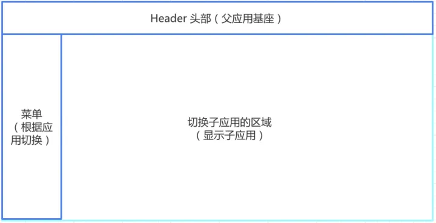
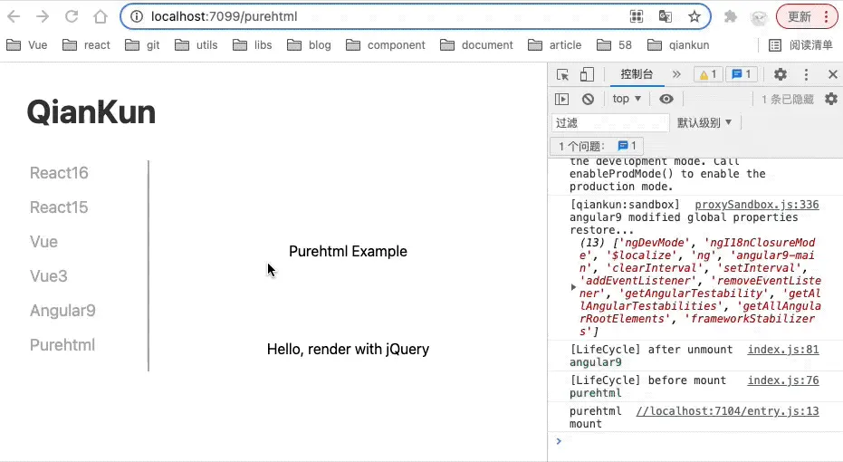
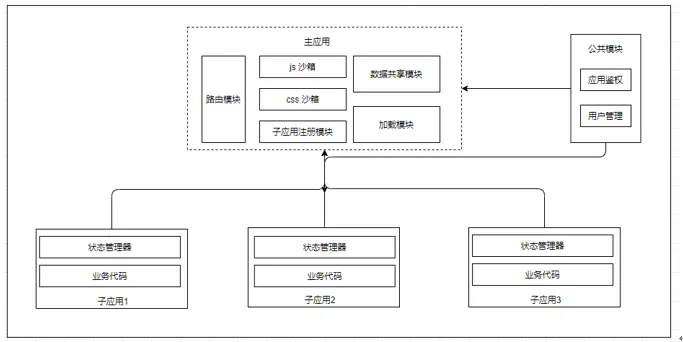

# qiankun微前端原理介绍

## 什么是微前端

微前端是一种多个团队通过独立发布功能的方式来共同构建现代化 web 应用的技术手段及方法策略。将前端应用分解成一些更小、更简单的能够独立开发、测试、部署的小块，而在用户看来仍然是内聚的单个产品。

我们先来粗略了解一下微前端项目的界面结构：



从上图可以明确地看到，微前端的主要布局可以分为三个部分：Header头部，菜单，以及子应用区域。

而我们要做的，就是通过切换菜单，然后再子应用区域切换为该菜单相应的子应用。

具体效果展示：



## 微前端的特点

* 技术栈独立 - 每个子应用都可以使用不同的框架、依赖等技术栈进行开发
* 独立开发，独立部署 - 每个子应用的仓库、开发、部署都是独立进行的，无需像其他web应用那样全量部署
* 沙箱隔离 - 每个应用之间的环境、状态、js、css相互隔离，运行时不共享不冲突

## 为什么不选择iframe

单看上面的概念和特点，有小伙伴可能会奇怪为什么不直接使用iframe，而是要搞那么多花里胡哨？

当然使用iframe也会有很多痛点，典型的有以下问题：

* url不同步 - iframe中的url与主体容器的url，这也意味着浏览器的前进后退无法直接响应iframe内的url
* DOM结构独立 - iframe与主体之间的DOM和JS脚本实则相互独立，最直接的例子就是假设从iframe的子模块中弹出一个带全局遮罩层的提示窗，显然它无法直接跨越iframe的界限展示在主体容器内
* 上下文隔离，全局环境和状态等不共享 - Cookie、LocalStrorage等或者其他一些状态值管理，除非处于同源，否则无法直接操作，当然也可以使用PostMessage处理这个问题，但这些方法不是效率不高就是具有局限性，特别是对于传递一些结构较为复杂的数据或直接传递一个函数的时候
* 同源策略问题 - 同源策略问题正如上一个痛点所说的，无疑加重了应用间的通信难度
* 加载缓慢 - 每个iframe实际上都是独立访问一个网站，访问多个网站的效率相比单独一个网站来说，显然是极其低效和不稳定的

问得好，其实确实有存在iframe的解决方案，那就是wujie。由于本次分享以qiankun为例，就不详细说wujie的解决这些问题的思路了，有兴趣的小伙伴可以自行去了解一下。

## 使用场景

* 需要对大型工程进行拆分解耦
* 较低成本的应用改造
* 在老项目中使用新的前端技术栈
* 对产品体验有高要求
* 开发无感知

## qiankun的优势

| \          | qiankun                     | iframe                                     |
| ---------- | --------------------------- | ------------------------------------------ |
| 数据共享   | window                      | hash/query/LocalStorage(同源)/Cookie(同源) |
| 事件机制   | 私有通信机制                | PostMessage                                |
| 访问历史   | 全局统一，以主体容器url为准 | 主体容器及各应用各自隔离                   |
| 全局作用域 | 共享                        | 完全隔离                                   |
| CSS作用域  | 按需隔离                    | 完全隔离                                   |
| 资源价值   | 整体且快速，可预加载        | 独立且缓慢                                 |

qiankun在事件机制处理方式上，封装了一套私有的通信机制，各个应用间可通过封装好的API进行双向数据交互


* single-spa（单页应用）的路由会和ng重定向冲突

## JS沙箱

JS沙箱通过限制代码的访问权限、提供隔离的执行环境、使用安全策略和沙箱沙盒技术等手段来实现。常见的 JavaScript 沙箱技术包括沙盒环境、Web Worker、iframe、JavaScript 虚拟机等。这些技术通过限制代码的执行权限、提供独立的运行环境、隔离全局上下文等方式来确保代码的安全执行。

其中qiankun提供了以下三种沙箱：

### 快照沙箱-SnapshotSandbox

实现原理：

在激活沙箱时，window上发生改变的所有属性，全都储存起来，在下一次再次被激活时，复现这些已更改的属性、

而在失活状态时，则window中被改变的属性应该被还原为激活前的值。

可以用以下代码简单举个例子：

```js
// 沙箱激活前
window.test = '11111'
console.log(window.test)  // 11111

// 激活沙箱
sandbox.active()
window.test = '22222'
console.log(window.test)  // 22222

// 沙箱失活
sandbox.inactive()
console.log(window.test)  // 11111

// 再次激活沙箱
sandbox.active()
console.log(window.test)  // 22222
```

优点：

* 支持不兼容Proxy的浏览器，兼容性较好

缺点：

* 需要遍历window上所有属性，性能较差
* 同一时间只能用于一个应用，相当于仅能激活一个子应用
* 污染全局window，这也是造成上一个缺点的原因

### Legacy沙箱-LegacySandbox（单例）

功能实际上和快照沙箱相同，但过程是用Proxy实现的

优点：

* 采用Proxy代理属性，无需遍历window上所有属性，性能较好

缺点：

* 由于污染了全局window，因此同一时间依然只能运行一个子应用
* 兼容性相较差

### ProxySandbox沙箱（多例）

原理是于contructor中以全局的window为原型创建一个fakeWindow对象，并采用Proxy代理这个对象，激活时使用的全程均不会污染全局window的属性，只有当读取属性值时，fakeWindow中未获取到相应对象的属性值才会去window中查找

优点：

* 采用Proxy代理属性，无需遍历window上所有属性，性能较好
* 不会污染全局window，因此能够支持多应用
* 应用/沙箱失活后，依然能够获取到其激活时发生改变的属性

缺点：

* 兼容性相较差

## 样式隔离

qiankun的样式隔离方案：

* shadow dom（sanbox: strictStyleIsolation）
* scoped css（sanbox: experimentalStyleIsolation）

在start方法中，配置sanbox属性，即可开启css隔离：

```js
// sanbox: boolean | { strictStyleIsolation?: boolean, experimentalStyleIsolation?: boolean }
start({
  sanbox: true
})
```

若将设置为true，qiankun则会为每个微应用包裹一层shadow dom（可以参考原生video标签的控制栏样式）

### strictStyleIsolation(shadow DOM)

shadow DOM是html原生自带的一种样式隔离方案，简单来说就是其所包裹的内部内容和样式会和其他普通DOM节点完全隔离，其他具体详情可以自行了解，现在我们只知道是这么回事就行了。

有小伙伴可能会想，既然如此，直接用shadow DOM不就万事大吉了吗？并不是的，特别是在React中，一些对事件的处理可能不那么奏效了！

我们需要在子应用的JS代码，调起一个提示窗挂在主容器全局的body下（因为子应用的布局未必是铺满整个主容器的），但同时要使用子应用内部的样式，那么这时候就会有问题了，css被彻底隔离在shadow DOM中，外部读取不到啊？

### experimentalStyleIsolation(子应用容器 - 选择器)

这里还要说一下另外一个experimentalStyleIsolation参数（注意，experimentalStyleIsolation和strictStyleIsolation两者是相互冲突的，不能同时开启）

当experimentalStyleIsolation为true时，会改写子应用所添加的所有样式规则增加一个特殊的选择器规则来限定其影响范围，因此改写后的代码会表达类似为如下结构：

```css
// 假设应用名是 react16 中的样式是这样
.app-main {
  font-size: 14px;
}

// ===== 处理后 ======>

div[data-qiankun-react16] .app-main {
  font-size: 14px;
}
```

作用效果有点类似Vue Scoped，给每个子应用加了一个唯一的属性选择器

### 如何评价qiankun自带的样式隔离方案

比如原生或JQuery为基础的老项目，还是比较建议qiankun的样式隔离的

但对于现代的前端框架（如Vue、React等），都已经拥有自带的组件级别的样式隔离方案，就没有必要使用和实际需求存在矛盾点的qiankun样式隔离方案了

### Vue Scoped

在 Vue 的单文件组件中使用 <style scoped> 标签时，Vue 会自动将该样式应用于当前组件的元素，并在编译过程中为每个 CSS 规则添加一个唯一的属性选择器，以确保样式仅对当前组件有效：

```css
h3 {
  background-color: pink;
  color: blue;
}

// ======= 使用 style scoped 后 ====>

h3[data-v-469af010] {
  background-color: pink;
  color: blue;
}
```

但这也一样有问题，如果我们将某个弹窗放置在子应用外层（如body层下），那么由于其原本需要的样式被CSS选择器限定在了子应用的容器内，这个弹窗的样式依然是匹配不上子应用内部的样式的

### css module[hash]

除了qiankun使用的以上两种方案以外，还有css module这个方式。该方式是通过配置webpack中的css-loader，使其输出的css文件作为单独的module，并为所有className加上一个[hash]值（与css scoped方式的原理是一样的），这样就达到了样式隔离的目的：

```js
// webpack.config.js
{
  test: /\.(le|c)ss$/,
  use: ['style-loader', {
    loader: 'css-loader',
    options: {
      modules: true // 开启 css modules
    }
  }, 'less-loader'],
},
```

## 微前端运行原理

### 监听路由变化

和Vue一样，qiankun同样有两种路由实现形式：

* hash路由：window.onhashchange
* history路由：history.go、history.back、history.forward使用popstate事件window.onpopstate（会和NG的路径匹配冲突）
### 匹配子应用

监听路由的变化后，拿到当前路由的路径window.location.pathname，然后根据各个子应用都会配置的activeRule来利用registerMicroApps的参数apps查找子应用

```js
// 如果当前的 pathname 以 activeRule 开头，表明匹配到了子应用
const currentApp = apps.find(app => window.location.pathname.startWith(app.activeRule))
```

### 加载子应用

当我们找到了与当前路由匹配的子应用，接着就去加载这个子应用的资源。这个时候，我们就拿到了子应用的 html 文本

但是我们不能给直接通过container.innerHTML = html将文本放到容器内，这样是无法显示的

另外要注意，浏览器处于安全考虑，放到页面上的 html 如果包含了 js 脚本，它是不会去执行 js 的。我们需要手动处理 script 脚本

### 渲染子应用(importHTML加载资源/处理脚本)

这一步共做了3个事情：

* 将获取的html文本放入template DOM节点中
* 获取所有Script脚本
* 执行所有Script脚本

qiankun中正是通过引用的import-html-entry就是做这个事的，我们可以来写个建议的模型：

```js
export const importHTML = url => {
  const html = await fetch(currentApp.entry).then(res => res.text()

  const template = document.createElement('div')

  template.innerHTML = html

  const scripts = template.querySelectAll('script')

  const getExternalScripts = () => {
    console.log('解析所有脚本: ', scripts)
  }

  const execScripts = () => {}

  return {
    template, // html 文本
    getExternalScripts, // 获取 Script 脚本
    execScripts, // 执行 Sript 脚本
  }
}
```

Script脚本分为内联脚本和外链脚本，这里需要分开处理，拿到内联脚本后，获取内容可以通过 eval 直接处理。如果是含有scr的script脚本，还需要拿到src的值，通过fetch去加载获取脚本内容。我们在 getExternalScripts 方法中来处理：

```js
const getExternalScripts = async () => {
  return Promise.all(Array.from(scripts).map(script => {
    // 获取 scr 属性
    const src = script.getAttribute('src')

    if (!src) {
      return Promise.resolve(script.innerHTML)
    } else {
      return fetch(src.startWith('http') ? src : `${url}${src}`).then(res => res.text())
    }
  }))
}
```

然后我们就可以通过 execScripts 方法去调用 getExternalScripts，拿到所有的脚本内容后，执行：

```js
const execScripts = async () => {
  const scripts = await getExternalScripts() 
  scripts.forEach(code => {
    eval(code)
  })
}
```

## qiankun的子应用引入

qiankun中配置路由及对应的子应用和规则内容等：

```js
registerMicroApps(
  [
    {
      name: 'react16',
      entry: '//localhost:7100',
      container: '#subapp-viewport',
      loader,
      activeRule: '/react16',
    },
    {
      name: 'react15',
      entry: '//localhost:7102',
      container: '#subapp-viewport',
      loader,
      activeRule: '/react15',
    },
  ]
)
```

此外，在引入我们的子应用，前我们的子应用应的输出格式为umd，并且要允许跨域。以Vue的vue.coonfig.js配置为例：

```js
// vue.config.js

module.exports = {
  devServer: {
    // ...
    headers: {
      'Access-Control-Allow-Origin': '*',
    },
  },
  // 自定义webpack配置
  configureWebpack: {
    output: {
      // 把子应用打包成库文件、格式是 umd
      library: `${name}-[name]`,
      libraryTarget: 'umd',
      jsonpFunction: `webpackJsonp_${name}`,
    },
  },
}
```

### 题外话：umd

umd格式是一种既可以在浏览器环境下使用，也可以在node环境下使用的格式

简单来说就是它将CommonJS、AMD以及普通的全局定义模块三种模块模式进行了整合，可以同时兼容这几种形式的模块引入方式，即require、import、script标签引入等

#### 为什么qiankun要求子应用打包为umd库格式呢

主要是为了主应用能够拿到子应用在入口文件导出的生命钩子函数（bootstrap、mount、unmount），这也是主应用和子应用之间通信的关键

## qiankun如何获取应用资源

HTML Entry + Sandbox是qiankun区别于single-spa的主要两个特性

single-spa和qiankun最大的不同，大概就是qiankun实现了html entry，而single-spa只能是js entry

通过import-html-entry，我就能像 iframe 一样加载一个子应用，只需要知道其 html 的 url 就能加载到主应用中

importHTML几个核心方法：

首先importHTML的参数为需要加载的页面url，拿到后会先通过fetch方法读取页面内容

```js
import importHTML from 'import-html-entry';

importHTML('./subApp/index.html')
  .then(res => {
    console.log(res.template);

    res.execScripts().then(exports => {
      const mobx = exports;
      const { observable } = mobx;
      observable({
        name: 'kuitos'
      })
    })
});
```

### 返回值

* template - string - 处理过的 HTML 模板
* assetPublicPath - string - 资源的公共路径
* getExternalScripts - Promise<string[]> - 来自模板的脚本URL
* getExternalStyleSheets - Promise<string[]> - 来自模板的StyleSheets URL
* execScripts - (sandbox?: object, strictGlobal?: boolean, execScriptsHooks?: ExecScriptsHooks): - 返回一个Promise对象，其返回值是由入口脚本设置的window或代理window上的最后一个属性
  * sandbox - 可选参数，表示Window对象或代理Window对象
  * strictGlobal - 可选参数，严格执行沙盒限制

strictGlobal模式下，子应用之间更加隔离，相互之间无法访问或修改全局变量，更安全可靠；而普通模式下，子应用之间可以通过全局变量共享数据，但需要注意全局变量的修改可能会影响其他子应用。选择使用哪种模式取决于具体场景和需求

## 常用实践架构



从上图可以看出。我们将整个项目分为主应用、子应用，以及公共模块。

* 主应用：作为主容器和所有子应用和公共模块的调度官，负责注册子应用以及调度治理子应用功能
* 子应用：除了通过qiankun框架提供的状态管理器进行子应用间，或与主应用通讯外，基本上主要是对自己负责，负责内部具体业务逻辑
* 公共模块：负责在主应用中对应用鉴权，以及用户管理模块

其实可以看出，这个实践架构和我们目前基于Vue的新前端架构时非常相似的，包括主容器、子模块、公共模块等，基本都是一致的。只是区别在于微前端在划分、引入和打包主模块和子模块的流程和实现上的区别（当然这也是两者本质上的不同，最终效果也完全不一样）

| \                | 新架构                                                           | qiankun                                                                            |
| ---------------- | ---------------------------------------------------------------- | ---------------------------------------------------------------------------------- |
| 运行及子模块引入 | 打包前引入，需要以主容器为基础运行                               | 可独立运行，运行时在主容器中通过配置路由引入                                       |
| 依赖             | 全局共享同一套依赖                                               | 主容器及各个子模块各自维护独自的依赖，同一依赖无法共享（因此会产生重复依赖或组件） |
| 打包             | 主容器和所需子应用一同打包，最终的包将包含所有内容，打包效率较低 | 主容器及各个子模块各自打包，打包效率较高                                           |
| JS沙箱           | window共享，内部数据以Vuex命名空间进行隔离                       | 基于window的沙箱                                                                   |
| 样式隔离         | 使用Vue自带的Vue Scoped                                          | shadow Dom / CSS Scoped / 现代框架自带方案                                         |
| 使用场景         | 一包多用，按需引入子模块，有效降低服务器的存储压力               | 大型工程解耦维护或改造                                                             |
| 技术栈支持       | 单技术栈(Vue)                                                    | 支持多技术栈                                                                       |
| 改造成本         | 旧项目需根据相关配置改造                                         | 改造成本较低                                                                       |

## Monorepo架构（简单介绍）

值的一提的是，解决微前端中各个模块的依赖重复问题，可以了解一下Monorepo架构：

Monorepo模式是指将多个项目或应用放置在同一个代码仓库中管理的开发模式

在 Monorepo 中，可以将公共依赖包和公共组件作为共享资源，放置在代码仓库的合适位置，供不同的项目或应用使用。这样可以避免不同项目之间重复安装和维护相同的依赖包，也能够统一管理和更新公共组件。
以下是 Monorepo 模式下解决微前端中公共依赖包和公共组件的方式：

* 公共依赖包管理：将公共的依赖包放置在代码仓库的根目录或指定目录下，通过工具如 Yarn 或 Lerna 管理依赖包的安装、更新和版本控制。不同的项目或应用可以通过引用共享的依赖包来解决依赖关系，避免重复安装和冲突。
* 公共组件封装：将公共的组件封装为独立的包或模块，放置在代码仓库的特定目录中，并通过工具如 NPM 发布和安装。不同的项目或应用可以通过引用共享的组件来实现组件的复用和共享，提高开发效率和代码一致性。

通过 Monorepo 模式，可以集中管理和维护公共依赖包和公共组件，减少重复工作和资源浪费。同时，还能够促进团队协作和代码共享，统一规范和风格，提高整体项目的质量和可维护性。